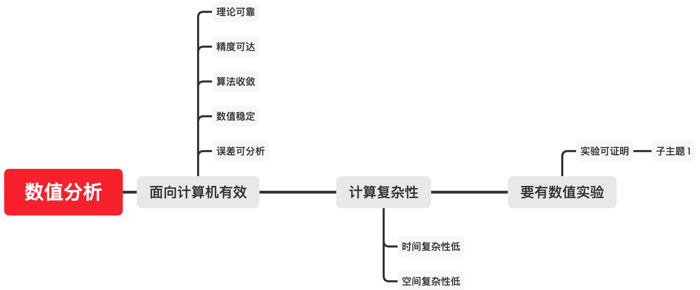

# 数值分析概述

基础数学：高等数学、线性代数和概率与数理统计。

基础数学的四大特征：

* 数学概念的抽象性——起始。
* 数学逻辑的严密性——过程。
* 数学结论的确定性——结论。
* 数学应用的广泛性——实践。

> [!warning]
>
> 数值分析主要体现在数学理论的应用与实践上。

## 科学计算

> [!note]
>
> 什么是科学计算？

科学计算是利用计算机再现、预测和发现客观世界运动规律和演化特征的全过程。

当代科学研究的三大支柱

* 理论分析
* 科学实验
* 科学计算

科学计算的全过程


数学建模就是科学计算过程的一种体现。

科学计算的对象：求解各类数学问题的数值方法及其理论。


科学计算的特点：

1. 无损伤。只需要计算机进行模拟。
2. 全过程、全时空的诊断。
3. 可重复。

> [!note]
>
> 求$x^2$在$x=2$处的导数。

根据导数的解析解计算
$$
\frac{\mathrm{d} y}{\mathrm{d} x} =2x
$$
根据导入定义
$$
\frac{df(x)}{dx}=\lim_{h\rightarrow0}\frac{f(x+h)-f(x)}{h}
$$
使用Python程序来实现上述计算

```
def numerical_diff(f, x):
    h = 10e-50
    return (f(x+h) - f(x)) / h
```

上述计算存在的问题：

1. `h = 10e-50`产生舍入误差（rounding error）。计算的精度超过了计算机的浮点数的表示范围。
2. 上述函数实际计算的是$[x, x+h]$之间的导数。

针对两点问题优化导入计算公式如下
$$
\frac{df(x)}{dx}\approx \lim_{h\rightarrow10^{-4}}\frac{f(x+h)-f(x-h)}{2h}
$$
代码实现如下

```python
#%%
def numerical_diff(f, x):
    h = 1e-4
    return (f(x+h) - f(x-h)) / (2*h)
  
def function_1(x):
    return x**2

result1 = numerical_diff(function_1, 2)
print(result1)
```

计算数学是研究数学问题在计算机上的数值求解方法的学科，有着数学研究的严密性。

科学计算是计算数学的应用领域，计算数学的研究成果在科学计算中得到了广泛应用。

> [!warning]
>
> 科学计算的任务，常常需要计算数学提供合适的数值方法和误差控制技术。


## 数值分析

数值分析是计算数学的一个重要分支，数值分析提供了计算数学中，核心的数值方法，用于解决各种数学问题，尤其是那些无法通过解析解法获得解的复杂问题。

数值分析的别称：数值计算、数值计算方法、数值逼近。

主要研究：**求解各种数学问题的数值计算方法及其理论与软件实现。**

> [!warning]
>
> 应该能够使用一门编程语言实践课程内容。

数值分析的应用方向

* 研究科学计算与工程计算相关的计算方法。
* 对算法及其应用进行理论和数值分析。
* 设计与研究用数值模拟方法代替实验。
* 研究应用软件和数值软件等。

交叉学科：计算力学、计算物理、计算化学和计算生物。

### 课程内容

1. 数值分析概述
2. 插值法
3. 函数逼近与曲线拟合
4. 数值积分和数值微分
5. 解线性代数方程组的直接法
6. 解线性代数方程组的迭代法
7. 非线性方程、方程组的数值解法
8. 矩阵特征值计算
9. 常微分方程初值问题数值解法

> [!warning]
>
> 部分内容结合编程实践。

### 数值分析的特点



## 如何学习

> 问题是数学的心脏——Paul Richard Halmos

1. “计算方法”有多少种？
2. “计算方法”的优缺点？
3. “计算方法”怎么用？
