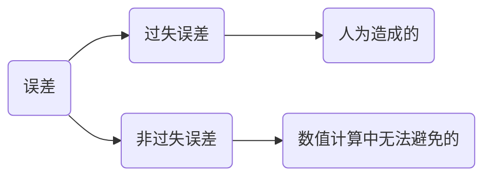

# 计算的误差

数值分析主要的对象是数值，数值的计算都是近似的，计算一定存在误差。

绝对误差：$x$代表真值，$x^*$代表近似值，$e=x-x^*$称为绝对误差，简称误差。

> [!warning]
>
> 在数值分析研究中真值是不存在的。

$$
e=x-x^*=\left\{\begin{matrix}
 < 0 & \text{强近似值} \\
 > 0 & \text{弱近似值}
\end{matrix}\right.
$$

由于真值找不到，主要研究的对象转化为

$$
\left | e \right | = \left | x-x^* \right | \le  \epsilon
$$

$\epsilon$称为绝对误差限，简称误差限。这个误差限可以通过理论推导求得。误差限还可表示为

$$
x^*- \epsilon \le x \le x^*+ \epsilon\quad \text{or} \quad x=x^*\pm \epsilon
$$

> [!warning]
>
> 误差限不是唯一存在，但是有精确度的区别。

例如，线性方程组及其系数保留两位有效数字，形式如下：

$$
\left\{\begin{matrix}
x_1+\frac{1}{2} x_2+\frac{1}{3} x_3 = \frac{11}{6}\\
\frac{1}{2}x_1+\frac{1}{3} x_2+\frac{1}{4} x_3 = \frac{13}{12} \\
\frac{1}{3}x_1+\frac{1}{4} x_2+\frac{1}{5} x_3 = \frac{47}{60}
\end{matrix}\right.
\Rightarrow
\left\{\begin{matrix}
x_1+0.5x_2+0.33x_3 = 1.8\\
0.5x_1+0.33x_2+0.25x_3 =1.1 \\
0.33x_1+0.25x_2+0.2 x_3 = 0.78
\end{matrix}\right.
$$

方程组的准确解为

$$
x_1=x_2=x_3=1
$$

方程的近似解为

$$
x_1=-6.22…,\quad x_2= 38.25…, \quad x_3= -33.65…
$$

使用Python程序模拟上述过程，方程组计算如下

```python
import numpy as np

A = np.array([[1, 1/2, 1/3],
              [1/2, 1/3, 1/4],
              [1/3, 1/4, 1/5]])
b = np.array([11/6, 13/12, 47/60])
# 使用NumPy的线性方程求解方法
x = np.linalg.solve(A, b)
print("解为 x1, x2, x3:", x)
```

近似方程组计算如下

```python
A = np.array([[1, 0.5, 0.33],
              [0.5, 0.33, 0.25],
              [0.33, 0.25, 0.2]])
b = np.array([1.8, 1.1, 0.78])

x = np.linalg.solve(A, b)
print("近似解为 x1, x2, x3:", x)
```

## 相对误差

相对误差可以表示为

$$
e_r=\frac{e}{x}=\frac{x-x^*}{x}
$$

但是由于真值无法获得，所以可以表示为

$$
e_r=\frac{e}{x^*}=\frac{x-x^*}{x^*}
$$

这个误差称为相对误差。相对误差限可表示为

$$
\left | e_r \right | = \left | \frac{e}{x^*} \right | = \left | \frac{x-x^* }{x^*} \right | \le  \epsilon_r
$$

函数值的绝对误差

$$
e\left | f(x) \right | = {f}'(x)e(x)={f}'(x)(x-x^*)\approx \mathrm{d}f(x)
$$

函数的误差近似等于其微分。

> [!note]
>
> 两个同学，一个150分满分考了139，另一个100分满分考了90。两者的绝对误差分别为11和10，优劣如何。

同学一，相对误差

$$
\frac{150-139}{150}\approx0.073
$$

同学二，相对误差

$$
\frac{100-90}{100}=0.1
$$

相对误差的意义：

1. 相对误差比绝对误差更能反映准确值与近似值之间的差异。
2. 绝对误差和相对误差有无穷多，自然越小越好。
3. 误差估计的任务就是提供好的误差限，误差限越小，数据越准确可靠。

> [!note]
>
> 设$S=\frac{1}{2}gt^2$，假设$g$是准确的，而对$t$的测量有$\pm0.1$秒的误差，证明当$t$增加时$S$的绝对误差增加，而相对误差减小。

绝对误差

$$
e(S)=S^*-S=\frac{1}{2}g{t^*}^2-\frac{1}{2}gt^2=0.1gt
$$

相对误差

$$
e_t(S)=\frac{e(S)}{\frac{1}{2}gt^2}=\frac{0.1gt}{\frac{1}{2}gt^2}=\frac{0.2}{t}
$$

所以有

$$
t\uparrow \Rightarrow \left\{\begin{matrix}
e(S)\uparrow \\
e_r(S)\downarrow 
\end{matrix}\right.
$$

函数值的相对误差限

$$
e_r\left | f(x) \right | = \left | \frac{e(f(x))}{f(x)}  \right | = \left | \frac{{f}'(x)e(x)}{f(x)}  \right |
$$

> [!note]
>
> 计算球体积要使相对误差限为$1\%$，问度量半径为$R$时，允许的相对误差限时多少？

球的体积公式

$$
V(R)=\frac{4}{3}\pi R^3
$$

相对误差限为

$$
e_r\left | V(R) \right |  = \left | \frac{{f}'(x)e(x)}{f(x)}  \right |= \left | \frac{4\pi R^2e(x)}{\frac{4}{3}\pi R^3}  \right |=3\left | \frac{e(R)}{R}\right |=3\left | e_r(R)\right |
$$

所以可得

$$
\left | e_r(R)\right |=\frac{1}{3}e_r\left | V(R) \right |\le \frac{1}{3}\times1\%=0.333\%
$$

> [!warning]
>
> 后续教程提到绝对误差和相对误差，一般指的是误差限。

## 有效数字

若$\left | e \right |=\left | x-x^* \right | \le0.5\times10^{-k}$，则称近似数$x^*$准确到小数点后$k$位。并且从第一个非零数字到 这一位的所有数字均称为有效数字。

1. 由四舍五入得到的数字都是有效数字。
2. 有效数字越多，误差越小，计算结越精确。

> [!note]
>
> 设$x^*=\sqrt{3}=1.7320508…$，其中$x_1=1.73$，$x_2=1.7321$，$x_3=1.7320$，是其近似值，它们分别有几位有效数字？

$$
\left|x-x_1 \right|=\left|\sqrt{3}-1.73 \right|=0.2058…\times10^{-2}\le0.5\times10^{-2}
$$

精确到小数点后2位，有3位有效数字。

$$
\left|x-x_2 \right|=\left|\sqrt{3}-1.7321 \right|=0.491…\times10^{-4}\le0.5\times10^{-4}
$$

精确到小数点后4位，有5位有效数字。

$$
\left|x-x_3 \right|=\left|\sqrt{3}-1.7320 \right|=0.508…\times10^{-4}\le0.5\times10^{-3}
$$

精确到小数点后4位，有4位有效数字。

> [!note]
>
> 根据四舍五入的原则，写出下列个数具有5位有效数字的近似数：
>
> 187.9325、8.000033、2.7182818

$$
187.9325 \Rightarrow 187.93 \\ 
8.000033 \Rightarrow 8.0000 \\
2.7182818\Rightarrow 2.7183
$$

注意：

1. 8.000033，5位有效数字是不8。
2. 有效数字的位数与小数点位置无关。

## 误差的分类



### 模型误差

模型误差 数学模型与实际问题之间出现的误差。

交通流量问题的模型假设：

1. 全部流入网络的流量=全部流出网络的流量；
2. 全部流入一个节点的流量=全部流出此节点的流量。

该问题满足10个变量的线性方程组

$$
\left\{\begin{matrix}
x_2-x_3+x_4 = 300 \\
x_4+x_5=500 \\
x_6-x_7=200 \\
x_1+x_2=800 \\
x_1+x_5=800 \\
x_7+x_8=1000 \\
x_9=400 \\
x_10-x_9=200 \\
x_10=600 \\
x_8+x_3+x_6 = 1000
\end{matrix}\right.
$$

这里的模型假设可能会造成误差。

### 观测误差

由测量产生的误差。

* 仪器误差。
* 测量水平问题。

已知实验数据如下：

| $x_i$ | 100 | 110 | 120 | 130 | 140 | 150 | 160 | 170 | 180 |
| ------- | --- | --- | --- | --- | --- | --- | --- | --- | --- |
| $y_i$ | 45  | 51  | 61  | 66  | 70  | 74  | 78  | 85  | 89  |

求符合数据的4次拟合曲线。

### 截断误差

由简化问题（公式）所引起解的误差。

将函数$f(x)=(1+x)\ln(1+x)$展开成的幂级数

$$
x+\frac{x^2}{2}-\frac{x^3}{6}+\frac{x^4}{12}-\frac{x^5}{20}+\frac{x^6}{30}-\frac{x^7}{42}
+\frac{x^8}{56}-\frac{x^9}{72}+\frac{x^{10}}{90}-\frac{x^{11}}{110}+o(x^{11})
$$

函数$f(x)$用泰勒多项式近似代替

$$
P_n(x)=f(0)+\frac{{f}’(0)}{1!}x+\frac{{f}''(0)}{2!}x^2+…+\frac{{f}^{n}(0)}{n!}x^n
$$

则截断误差是泰勒公式的余项

$$
R_n(x)=f(x)-p_n(x)=\frac{{f}^{n+1}(\xi)}{(n+1)!}x^{n+1} \qquad 0<\xi<x
$$

### 舍入误差

数字计算过程中产生的误差。

$$
\pi =3.1415926…
$$

## 误差的传播

若两个近似数$x_1^*$与$x_2^*$，其绝对误差限分别为$\epsilon(x_1^*)$及$\epsilon(x_2^*)$，则误差的四则运算如下

1. 加减误差

$$
\left | e(x_1^*\pm x_2^*) \right | =\left | e(x_1^*) \pm e(x_2^*)\right | \le \epsilon(x_1^*) + \epsilon(x_2^*)
$$

2. 乘法误差

$$
\left | e(x_1^* x_2^*) \right | \approx \left | x_1^*e(x_2^*) + x_2^*e(x_1^*)\right | \le \left | x_1^* \right | \epsilon(x_2^*) + \left | x_2^* \right |\epsilon(x_1^*)
$$

3. 除法误差

$$
e(\frac{x_1^*}{x_2^*}) \approx \frac{ x_1^*e(x_2^*) - x_2^*e(x_1^*)}{{x_2^*}^2} \quad （x_2^*\ne 0） \Rightarrow \\
\left | e(\frac{x_1^*}{x_2^*}) \right | \le \left | \frac{ x_1^*e(x_2^*) - x_2^*e(x_1^*)}{{x_2^*}^2} \right | \le \left | \frac{x_1*}{{x_2^*}^2} \right |\epsilon(x_2^*) + \left | \frac{x_2^*}{{x_2^*}^2} \right |\epsilon(x_1^*)
$$

4. 函数的误差

$$
e(y^*)=y-y^*=f(x)-f(x^*)=\Delta y\approx \mathrm{d}y
$$

在四则运算的基础上误差会被放大。

若两个近似数$x_1^*$与$x_2^*$，其相对误差限分别为$\epsilon_r(x_1^*)$及$\epsilon_r(x_2^*)$，这

$$
\epsilon_r(x_1^*\pm x_2^*)=  \frac{ \left |x_1^*\right |\epsilon_r(x_1^*) + \left |x_2^*\right |\epsilon_r(x_2^*)}{\left |x_1^*\pm x_2^*\right |}
$$

特别地$x_1^*$与$x_2^*$同号时

1. 加减相对误差

$$
\epsilon_r(x_1^*\pm x_2^*)=\max\{ \epsilon_r(x_1^*), \epsilon_r(x_2^*) \}
$$

2. 乘法相对误差

   $$
   \epsilon_r(x_1^* x_2^*) \approx\epsilon_r(x_1^*)+\epsilon_r(x_2^*)
   $$
3. 除法相对误差

$$
\epsilon_r(\frac{x_1^* }{x_2^*}) \approx\epsilon_r(x_1^*)+\epsilon_r(x_2^*)
$$

4. 函数相对误差

$$
e_r(y^*)=\frac{e(y^*)}{y^*}\approx\frac{\mathrm{d}y^*}{y^*}=\frac{{y^*}’e(x)}{y^*}=d(\ln y^*)
$$

> [!note]
>
> 求$y_1=x^n，y_2=\ln x$的相对误差（相对误差限）。

函数1

$$
e_r(y_1)=\mathrm{d}(\ln x^n)=n\mathrm{d}(\ln x)=ne_r(x)
$$

函数2

$$
e_r(y_2)=\mathrm{d}(\ln\ln x^n)
=\frac{\mathrm{d}(\ln x)}{\left |\ln x \right | }=\frac{e_r(x)}{\left |\ln x \right |}
$$

## 误差的改善

在数值分析的计算过程中，误差无法避免，只能改善。

### 使用稳定的算法

在运算过程中，舍入误差能控制在某个范围内的算法，称为数值稳定的算法，否则就称为不稳定算法。

> [!note]
>
> 计算$I_n=\int_{0}^{1} x^ne^{x-1}\mathrm{d}x, \quad n=0, 1, 2… $，并估计误差

**方案A：**分部积分公式

$$
\int u \mathrm{d}v=uv−\int v \mathrm{d}u
$$

使用分部积分公式

$$
I_n 
=e^{-1}\left [x^ne^x\bigg|_0^1- \int_{0}^{1} n x^{n-1}e^{x}\mathrm{d}x \right] 
=e^{-1}\left [ e-n \int_{0}^{1} x^{n-1}e^{x}\mathrm{d}x\right] 
=1-nI_{n-1}
$$

近似值的递推公式

$$
I_n^*=1-nI_{n-1}^*
$$

误差$e(\ln*)$的

$$
e(I_n^*)=-ne(I_{n-1}^*)
$$

保留4位有效数字，

$$
\left\{\begin{matrix}
I_0=1-e^{-1}\approx0.6321=I_0^* \\
I_n^*=1-nI_{n-1}^*
\end{matrix}\right.
$$

**方案B：**，因为

$$
0<e^{x-1}<1
$$

所以

$$
0<\frac{e^{-x}}{n+1}=\int_{0}^{1} x^ne^{-1}\mathrm{d}x<I_n<\int_{0}^{1} x^n\mathrm{d}x=\frac{1}{n+1}
$$

例如：$0.0460<I_7<0.1250$，$0.0409<I_7<0.1111$


> [!attention]
>
> 递推公式的计算会淹没真值，不宜采用。

### 避免两个相近数相减

如果$x_1$和$x_2$很接近时，应用

$$
\lg x_1-\lg x_2=\lg\frac{x_1}{x_2}
$$

当$x$很大时，应用

$$
\sqrt{x+1}-\sqrt{x}=\frac{1}{\sqrt{x+1}+\sqrt{x}}
$$

> [!note]
>
> 求一元二次方程$x^2-16x+1=0$的小正根。

根据求根公式得到

$$
x_1=8+\sqrt{63}, \quad x_2=8-\sqrt{63}\approx8-7.94=0.06=x_2^*
$$

只有一位有效数字，改用除法

$$
x_2=8-\sqrt{63}=\frac{1}{8+\sqrt{63}}\approx\frac{1}{15.94}\approx0.0627
$$

改用除法后有三位有效数字。

### 防止大数吃小数

> [!note]
>
> 在4位有效数字的限制下，计算

$$
A=2000+\sum_{k=1}^{1000}\delta_i\quad 
\text{其中} 0.1\le\delta_i\le0.4,\quad
i=1, 2, …,1000
$$

1. 从左向右相加2000有4位有效数字，小数全部被丢弃，结果为2000.
2. 先将小数相加

$$
2100=2000+0.1\times1000
\le A \le
2000+0.4\times1000=2400
$$

### 防止小数做除数

> [!note]
>
> 求方程$0.001x^2+1000x+0.001=0$的解。

根据求根公式可得

$$
x=\frac{-1000\pm \sqrt{1000^2+4\times0.001\times0.001}}{2\times0.001}
$$

直接计算，分母$0.002$极小，导致结果为$x\approx-10^6\pm-10^6$，导致误差极大。改进如下

$$
x_1
=\frac{-2c}{b+sign(b)\sqrt{b^2-4ac}}
=\frac{-2\times0.001}{1000+\sqrt{1000^2-0.000004}}
\approx-0.000001
$$

根据$x_1$求得$x_2$有

$$
x_2=\frac{c}{ax_1}\approx-999999.999999
$$

### 减少运算次数

减少运算次数可以不但节省时间，而且减少舍入误差

> [!note]
>
> 求列多项式在$x=2$的值，$P_4(x)=x^4+2x^3+3x^2+4x+5$

解法A，直接计算

* 乘法4+3+2+1=10次
* 加法4次

解法B，秦九韶算法（Horner算法）

$$
P_4(x)=(((x+2)+3)x+4)x+5
$$

* 乘法4次
* 加法4次

秦九韶算法的一般形式

$$
P(x) = a_nx^n+a_{n-1}x^{n-1}+…+a_1x+a_0
$$

多项式可以改写为

$$
P(x) = a_0+x(a_1+x(a_2+…+x(a_{n-1}+a_nx)…))
$$

根据上面的公式可以得到，初始值$y=a_n$，递推式

$$
y=a_i+xy\quad i=n-1, n-2,…,0
$$

使用Python实现上述算法

```python
def horner(coeffs, x):
    result = 0
    # 倒序遍历系数
    for coefficient in coeffs:
        result = result * x + coefficient
    return result

# 示例多项式 P(x) = x^4 + 2x^3 + 3x^2 + 4x + 5
coeffs = [1, 2, 3, 4, 5]
x_value = 2
print("P(2) =", horner(coeffs, x_value))
```

秦九韶算法不仅能高效地求多项式的值，还能通过一个简单的扩展同时求出多项式的导数。

$$
P(x) = na_nx^{n-1}+(n-1)a_{n-1}x^{n-2}+…+a_2x+a_1
$$

初始值为$y=na_n$，递推式

$$
y=a_i+ixy\quad i=n-1, n-2,…,1
$$

使用python代码实现上述算法

```python
def horner_forward(coeffs, x):
    n = len(coeffs) - 1  
    b = coeffs[0]      
    d = 0              
    for i in range(1, n + 1):
        d = d * x + b      # 先更新导数部分
        b = b * x + coeffs[i]  # 再更新多项式值
    return b, d

# 示例多项式 P(x)== x^4 + 2x^3 + 3x^2 + 4x + 5
coeffs = [1, 2, 3, 4, 5]
x_value = 2

P_val, P_deriv = horner_forward(coeffs, x_value)
print("P({}) = {}".format(x_value, P_val))
print("P'({}) = {}".format(x_value, P_deriv))
```

> [!tip]
>
> 教材第20页：第5题、第7题
