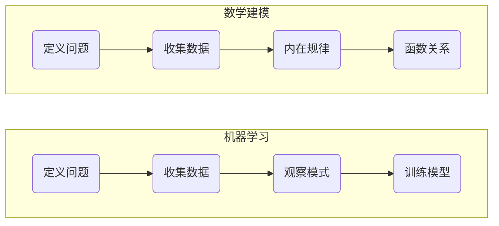
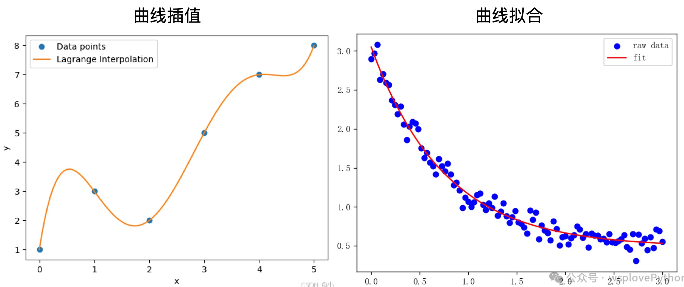

# 插值法的一般理论


## 问题引入

使用数学工具解决实际问题的流程



潜在的问题：

1. 使用数据是否存在内在规律？
2. 实验数据的内在规律是什么？
3. 内在规律是否有函数解析解？
4. 反映内在规律的解析式是什么？

> [!note]
>
> 正太分数函数表，如果查表计算$\Phi (1.014)$的值？


> [!note]
>
> 求机翼轮廓线上一点的近似数。


### 插值问题的一般描述

已知$n+1$个节点$(x_i, y_i)$且$(i=0, 1, …, n)$，其中$x_i$互不相同，不妨设$a=x_0<x_1<…<x_n=b$，求任一点插值$x^*(\ne x_i)$处的插值$y^*$。


构造平面曲线$y=G(x)$，使曲线通过所有节点，即$y_i=G(x_i)$且$(i=0, 1, …, n)$。

构造曲线的问题：

1. 这样的曲线是否存在？
2. 曲线的形状？
3. 曲线是否唯一？
4. 理想曲线无法获得，构造曲线和理想曲线之间的误差如何评价？

> [!warning]
>
> 构造曲线$y=G(x)$时，应该保证函数尽可能的简单。

## 插值法的概念

设函数$y=f(x)$在区间$[a, b]$上有定义，且已知在点$a\le x_0<x_1<…<x_n\le b$上的值分别为$y_0, y_1, …, y_n$若存在一简单函数$P(x)$，使$P(x_i)=y_i,(i=0, 1, 2, …,n )$：

1. $P(x)$为$f(x)$的**插值函数**。
2. 点$x_0, x_1, …,x_n$，称为**插值节点**。
3. 包含插值节点区间$[a, b]$称为**插值区间**。
4. 求插值函数$P(x)$的方法称为**插值方法**。

插值法的分类：

1. 若$P(x)$是次数不超过$n$的代数多项式，即$P(x)=a_0+a_1x+…+a_nx^n$。
2. 若$P(x)$是为分段多项式，就称为分段插值。
3. 若$P(x)$是为三角多项式，就称为三角插值。

本课程以多项式插值法为主。

## 插值法的原理

#### 定理

设有$n+1$个互不相同的节点$(x_i, y_i)$则存在唯一的多项式
$$
P_n(x)=a_0+a_1x+…+a_nx^n \tag{1}
$$
使得
$$
P(x_i)=y_i \quad (i=0, 1, 2, …,n )
$$

> [!warning]
>
> 上述定理中，已知数是$(x_i, y_i)$，未知数是$a_0, a_1, …,a_n$。

证明：

构造方程组
$$
\left\{\begin{matrix}
a_0+a_1x_0+…+a_nx_0^n=y_0 \\
a_0+a_1x_1+…+a_nx_1^n=y_1 \\
… \\
a_0+a_1x_n+…+a_nx_n^n=y_n
\end{matrix}\right.
$$
其中，未知数从$a_0$到$a_n$共$n+1$个，方程从$y_0$到$y_n$共$n+1$。

> [!warning] 
>
> 方程组有唯一解的充分必要条件是系数行列式不为零。

系数行列式
$$
A=\begin{bmatrix}
1  & x_0 & … & x_0^n \\
1  & x_1 & … & x_1^n \\
…  & …   & … & … \\
1  & x_n & … & x_n^n
\end{bmatrix}
\quad 
X=\begin{bmatrix}
a_0 \\
a_1 \\
… \\
a_n
\end{bmatrix}
\quad
Y=\begin{bmatrix}
y_0 \\
y_1 \\
… \\
y_n
\end{bmatrix}
$$
方程组的矩阵形式如下
$$
AX=Y
$$
其中$A$是[范德蒙矩阵](https://www.jianshu.com/p/34948915a649?utm_campaign=maleskine&utm_content=note&utm_medium=seo_notes&utm_source=recommendation)，其行列式的值为范德蒙行列式
$$
\left | A \right | =\prod_{i=1}^{n} \prod_{j=0}^{n-1}(x_i-x_j)\ne 0
$$
所以方程组有唯一解。所以方程 $(1)$ 唯一存在。

> [!attention]
>
> 1. 只要$n+1$个节点互异，满足上述插值条件的多项式是唯一存在的。
> 2. 如果不限制多项式的次数，插值多项式并不唯一。

定义三阶多项式
$$
P(x)=a_0+a_1x+a_1x^2+a_nx^3
$$
使用Python完成多项式插值

```python
import numpy as np
import matplotlib.pyplot as plt

# 数据点
x_points = np.array([0, 1, 2, 3])
y_points = np.array([1, 3, 2, 5])

# 构造范德蒙矩阵，注意：设置 increasing=True 得到从低次到高次的列
V = np.vander(x_points, N=len(x_points), increasing=True)
print("范德蒙矩阵 V =\n", V)

# 求解线性方程组，得到多项式系数（系数顺序为从低次到高次）
coefficients = np.linalg.solve(V, y_points)
print("多项式系数（从低次到高次）：", coefficients)

# 计算插值点的值
in_point = 1.66

# 定义一个函数，用来计算多项式在任意 x 处的值
def polyval(coeffs, x):
    return np.polyval(coeffs[::-1], x)

# 绘制插值多项式和数据点
x_vals = np.linspace(min(x_points) - 0.5, max(x_points) + 0.5, 200)
y_vals = polyval(coefficients, x_vals)
plt.figure(figsize=(8, 6))
plt.plot(x_points, y_points, 'ro', label="points")
plt.plot(x_vals, y_vals, 'b-', label="interpolation polynomial")
plt.plot(in_point, polyval(coefficients, in_point), 'go', label="interpolation point")
plt.xlabel("x")
plt.ylabel("y")
plt.title("Lagrange Interpolation")
plt.legend()
plt.grid(True)
plt.show()
```

## 曲线插值与曲线拟合

曲线插值与曲线拟合，都用于从离散数据点构造连续函数，最终目的是描述数据的变化规律。

二者的区别：

* 直观上，曲线插值样本点比较少，曲线拟合样本点比较多。
* 曲线插值，要求构造的近似函数，必须严格经过所有已知数据点。
* 曲线拟合，不要求函数经过所有数据点，而是通过最小化整体偏差，寻找能反映数据趋势的最优函数。
* 曲线拟合，可以看作是插值的推广。
* 二者使用的算法不同。



