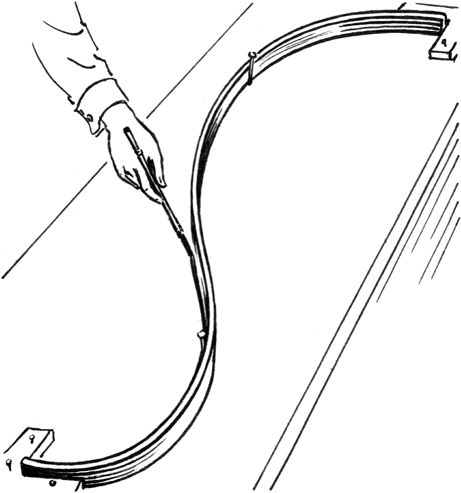

# 样条插值

> [!Note]
>
> 几种插值法的问题
>
> 1. 多项式插值，确定唯一的高阶多项式，但有可能有龙格线性。
> 1. 分段低次插值，分段点无法连续可导。

样条插值中的“样条”源于工程制图中使用的物理样条（如弹性木条或金属条），这些工具被固定在关键点之间自然弯曲形成光滑曲线。样条函数就是对这样的曲线进行的数学模拟得到的。

##  样条函数的概念

设$S(x)$是区间$[a, b]$上函数，在区间$[a, b]$上给定一组基点
$$
a=x_0<x_1<x_2<…<x_n=b
$$
若函数$S(x)$满足条件：

1. $S(x)$在每个子区间$[x_i, x_{i+1}]$，$i=1, 2, …, n-1$上是次数不超过$m$的多项式；
2. $S(x)$在区间$[a, b]$上有$m-1$阶连续导数；

则称$S(x)$是定义在区间$[a, b]$上的$m$次样条函数。$x_0,x_1,x_2,…$称为样条节点，其中$x_1,…,x_{n-1}$称为内节点，$x_0, x_n$称为边界节点。当$m=3$时，便成为最常用的三次样条函数。

> [!warning]
>
> 样条函数是一个分段函数，且样条函数在各个分段之间具有一定的**平滑性**要求。

### 三次样条插值

设$y=f(x)$在点
$$
a=x_0,x_1,x_2,…,x_n=b
$$
的值为$y_0,y_1,y_2,…,y_n$，若函数$S(x)$满足下列条件：

1. $S(x_i)=f(x_i)=y_i$，$i=1, 2, …, n-1$。
2. 在每个子区间$[x_i, x_{i+1}]$，$i=1, 2, …, n-1$上$S(x)$是三次多项式
3. $S(x)$在$[a, b]$上二阶连续可微。

则称$S(x)$为函数$f(x)$的三次样条插值函数。

### 样条函数的确定

$S(x)$除了满足基本样条插值条件$S(x_i)=f(x_i)$外还应具有如下形式
$$
S(x)=\left\{\begin{matrix}
S_0(x)  & x \in[x_0, x_1] \\
S_1(x)  & x \in[x_1, x_2] \\
… & \\
S_{n-1}(x) & x \in[x_{n-1}, x_n]
\end{matrix}\right.
\qquad 
S_i(x) \in F_3\left ( [x_i, x_{i+1}] \right )
$$
并且满足条件
$$
\left\{\begin{matrix}
S_{i-1}(x_i)=S_i(x_i) & i=1,2,…,n-1 \\
{S}'_{i-1}(x_i)={S}'_i(x_i)  & i=1,2,…,n-1 \\
{S}''_{i-1}(x_i)={S}''_i(x_i) & i=1,2,…,n-1
\end{matrix}\right.
$$
设函数
$$
S(x)=S_i(x)=a_i+b_ix+c_ix^2+d_ix^3, \quad x \in [x_i, x_{i+1}]
$$
其中$i=0,1, 2, …, n$，其中有$4n$个待定系数
$$
\left \{ a_i \right \},\left \{ b_i \right \},
\left \{ c_i \right \},\left \{ d_i \right \}
\quad 
i=1,2,…,n
$$
$S(x)$共需$4n$个独立条件确定。

1. 内部光滑条件

$$
\left\{\begin{matrix}
S_{i-1}(x_i)=S_i(x_i) & i=1,2,…,n-1 \\
{S}'_{i-1}(x_i)={S}'_i(x_i)  & i=1,2,…,n-1 \\
{S}''_{i-1}(x_i)={S}''_i(x_i) & i=1,2,…,n-1
\end{matrix}\right.
$$

$3(n-1)$个。

2. 插值条件

$$
S(x_i)=f(x_i) \quad i=0,1, 2, …, n
$$

$n+1$独立条件。共有方程$4n-2$个。

> [!warning]
>
> 这里有$4n$个待定系数，有$4n-2$个方程，所以一定存在函数$S(x)$。

如果希望函数$S(x)$唯一确定需要再增加两个条件方程，附加条件有多种形式。

附加条件一般在边界处增加，常用的三种边界条件

1. 第一种边界条件

$$
{S}'(x_0)={f}'(x_0)=m_0, \quad {S}'(x_n)={f}'(x_n)=m_n
$$

2. 第二种边界条件

$$
{S}''(x_0)={f}''(x_0)=M_0, \quad {S}''(x_n)={f}''(x_n)=M_n
$$

特别的$M_0=M_n=0$为自然边界条件。

3. 第三种边界条件（周期边界条件），$y=f(x)$为周期函数，要求$S(x)$也为周期函数，周期变为$b-a$，即取

$$
S^{(k)}(x_0)=S^{(k)}(x_n), \quad k=0, 1, 2
$$

此时称$S(x)$为周期样条函数。

> [!warning]
>
> 由以上给定的任意一种边界条件加上插值条件和连接条件，就能得到$4n$个方程，可以唯一确定$4n$个系数。从而得到三次样条插值函数$S(x)$在各子区间$[x_i,x_{i+1}]$上的表达式$S(x_i)$，$i=1, 2, …,n-1$。

## 样条函数的构造

1. 确定插值函数$S(x)$在节点处的一阶导数，记为${S}'(x_i)=m_i$，$i=0,1, 2, …, n$该方法即为3次样条插值函数的一阶导数表示。
2. 确定插值函数$S(x)$在节点处的一阶导数，记为${S}''(x_i)=M_i$，$i=0,1, 2, …, n$该方法即为3次样条插值函数的二阶导数表示。

记${S}''(x_i)=M_i$，$i=0,1, 2, …, n$，$f(x_i)=y_i$由于$S(x)$在区间$[x_i, x_{i+1}]$上是三次多项式，所以${S}_i''(x)$在$[x_i, x_{i+1}]$上是线性函数。根据拉格朗日插值公式得
$$
{S}_i''(x)=\frac{M_{i+1}}{h_i}(x-x_i)-\frac{M_i}{h_i}(x-x_{i+1}) \quad x\in[x_i, x_{i+1}]
$$
其中$h_i=x_{i+1}-x_{i}$。对${S}_i''(x)$积分得
$$
{S}_i'(x)=\frac{M_{i+1}}{2h_i}(x-x_i)^2-\frac{M_i}{2h_i}(x-x_{i+1})^2+C_1 \tag1
$$
对${S}_i'(x)$积分得
$$
{S}_i(x)=\frac{M_{i+1}}{6h_i}(x-x_i)^3-\frac{M_i}{6h_i}(x-x_{i+1})^3+C_1x+C_2 \tag2
$$
分别带入$S(x_i)=y_i$及$S(x_{i+1})=y_{i+1}$得
$$
\left\{\begin{matrix}
y_{i+1}=\frac{M_{i+1}}{6h_i}(x_{i+1}-x_i)^3+C_1x_{i+1}+C_2 \\
y_i=-\frac{M_i}{6h_i}(x_i-x_{i+1})^3+C_1x_i+C_2 \\
\end{matrix}\right.
$$
化简得
$$
\left\{\begin{matrix}
y_{i+1}=\frac{M_{i+1}}{6}h_i^2+C_1x_{i+1}+C_2 \\
y_i=\frac{M_i}{6}h_i^2+C_1x_i+C_2 \\
\end{matrix}\right.
$$
解得
$$
\left\{\begin{matrix}
C_1=\frac{y_{i+1}}{h_i}-\frac{h_i}{6}M_{i+1}-\frac{y_i}{h_i}+\frac{h_i}{6}M_{i} \\
C_2=-\frac{1}{h_i}\left [x_iy_{i+1}-\frac{h_i^2}{6}M_{i+1}x_i-x_{i+1}y_i+\frac{h_i^2}{6}M_{i}x_{i+1} \right ]  \\
\end{matrix}\right.
$$
将上述值带入公式 $(2)$ 可得
$$
\begin{aligned} 
{S}_i(x) 
&=
\frac{M_{i+1}}{6h_i}(x-x_i)^3-\frac{M_i}{6h_i}(x-x_{i+1})^3 \\
&-\left (y_i-\frac{M_ih_i^2}{6}\right) \frac{x-x_{i+1}}{h_i} \\
&+\left ( y_{i+1}-\frac{M_{i+1}h_i^2}{6}\right)\frac{x-x_i}{h_i}
\end{aligned}
$$
将$C_1$带入公式 $(1)$得到
$$
\begin{aligned} 
{S}_i'(x)
&=
\frac{M_{i+1}}{2h_i}(x-x_i)^2-\frac{M_i}{2h_i}(x-x_{i+1})^2 \\
&+\frac{y_{i+1}-y_i}{h_i}-\frac{M_{i+1}-M_i}{6}h_i
\end{aligned}
$$
其中$x\in[x_i, x_{i+1}]$，根据导数的连续性
$$
{S}'(x_i+0)={S}_i'(x_i+0)={S}'(x_i-0)={S}_{i-1}'(x_{i}-0)
$$
其中$i=1, 2,…,n-1$，计算可得
$$
-\frac{h_i}{2}M_i+\frac{y_{i+1}-y_i}{h_i}-\frac{M_{i+1}-M_i}{6}h_i
= 
-\frac{h_{i-1}}{2}M_i+\frac{y_{i}-y_{i-1}}{h_{i-1}}-\frac{M_{i}-M_{i+1}}{6}h_{i-1}
$$
化简得
$$
\frac{h_{i-1}}{6}M_{i-1}+\frac{h_{i-1}+h_i}{3}M_i+\frac{h_i}{6}M_{i+1}
=
\frac{y_{i+1}-y_i}{h_i}-\frac{y_{i}-y_{i-1}}{h_{i-1}}
$$
整理可得
$$
\frac{h_{i-1}}{h_{i-1}+h_i}M_{i-1}+2M_i+\frac{h_i}{h_{i-1}+h_i}M_{i+1}
=
\frac{6\left ( \frac{y_{i+1}-y_i}{h_i}-\frac{y_{i}-y_{i-1}}{h_{i-1}} \right ) }{h_{i-1}+h_i}  \tag3
$$
设参数如下
$$
\left\{\begin{matrix}
\alpha_i=\frac{h_{i-1}}{h_{i-1}+h_i}  \\
\beta_i=1-\alpha_i \\
\gamma _i=6f\left [x_{i-1},x_i,x_{i+1}  \right ] 
\end{matrix}\right.
$$
所以公式 $(3)$ 可以表示为
$$
\alpha_i M_{i-1}+2M_i+\beta_i M_{i+1}=\gamma_i \tag4
$$
公式 $(4)$ 称为三次样条的$M$关系式，其中有$n+1$未知数和$n-1$个方程，称为三弯矩方程。

> [!warning]
>
> 如果要计算三弯矩方程的未知数$M_i$还需要补充两个条件，补充条件通常需要根据实际问题的需要确定。

### 第一型边界条件

已知$f(x)$在两个端点的导数${f}'(a)={f}'(b)$要求
$$
{S}'(a)={f}'(a), \quad {S}'(b)={f}'(b)
$$
若$S(x)$满足${S}'(a)={y}'_0,{S}'(b)={y}'_n$，带入${S}'(x)$的表达式可得
$$
\left\{\begin{matrix}
{S}'(a)=-\frac{h_0}{2}M_0+\frac{y_{1}-y_0}{h_0}-\frac{h_0}{6}\left ( M_{1}-M_0 \right )={y}'_0 \\
{S}'(b)=\frac{h_{n-1}}{2}M_n+\frac{y_{n}-y_{n-1}}{h_{n-1}}-\frac{h_{n-1}}{6}\left ( M_{n}-M_{n-1} \right )={y}'_n 
\end{matrix}\right.
$$
化简得
$$
\left\{\begin{matrix}
2M_0+M_1=\frac{6}{h_0}\left ( \frac{y_1-y_0}{h_0}-{y}'_0 \right ) \to \gamma_0  \\
M_{n-1}+2M_n=\frac{6}{h_{n-1}}\left ({y}'_n- \frac{y_n-y_{n-1}}{h_{n-1}}\right ) \to \gamma_n
\end{matrix}\right.
$$
联立方程组
$$
\left\{\begin{matrix}
\alpha_i M_{i-1}+2M_i+\beta_i M_{i+1}=\gamma_i & i=1, 2,…,n-1 \\
2M_0+M_1=\frac{6}{h_0}\left ( \frac{y_1-y_0}{h_0}-{y}'_0 \right )  \\
M_{n-1}+2M_n=\frac{6}{h_{n-1}}\left ({y}'_n- \frac{y_n-y_{n-1}}{h_{n-1}}\right ) 
\end{matrix}\right.
$$
方程组表示如下
$$
\begin{pmatrix}
2  & \beta_0   &  &  & \\
\alpha_1   & 2  & \beta_1 &  & \\
  & \alpha_2 & 2   & \beta_2  & \\
  &  &  …&  …& …& \\
  &  &  &  \alpha_{n-1}& 2 & \beta_{n-1} \\
  &  &  &  & \alpha_{n} & 2
\end{pmatrix}
\begin{pmatrix}
M_0 \\
M_1 \\
M_2 \\
… \\
M_{n-1} \\
M_n
\end{pmatrix}
=
\begin{pmatrix}
\gamma_0 \\
\gamma_1 \\
\gamma_2 \\
… \\
\gamma_{n-1} \\
\gamma_n
\end{pmatrix}
$$
其中
$$
\left\{\begin{matrix}
\beta_0=\alpha_n=1  \\
\gamma_0=\frac{6}{h_0}\left ( \frac{y_1-y_0}{h_0}-{y}'_0 \right )     \\
\gamma_n=\frac{6}{h_{n-1}}\left ({y}'_n- \frac{y_n-y_{n-1}}{h_{n-1}}\right )
\end{matrix}\right.
$$
方程组的特点：

1. 方程组是关于$M_i$，$i=1, 2,…,n-1$的三对角方程组
2. $M_j$在力学上解释为细梁在$x_j$界面处的弯矩，因此$M_j$称为$S(x)$的矩，方程组称为三弯矩方程。
3. 因为系数矩阵满足严格对角占优的条件，所以方程组有唯一解。

> [!note]
>
> 已知函数$f(x)$的数值表如下
>
> | $x$       | 2    | 4    | 6    |
> | --------- | ---- | ---- | ---- |
> | $f(x)$    | 3    | 7    | 13   |
> | ${f}'(x)$ | 1    |      | -1   |
>
> 试求$f(x)$在$[2, 6]$上的三次样条插值函数。

这是第一类边界条件问题，$n=2,h_1=h=2$，
$$
\begin{pmatrix}
2  & \beta_0   & 0 \\
\alpha_1  & 2   & \beta_1 \\
0  & \alpha_2 & 2
\end{pmatrix}
\begin{pmatrix}
M_0 \\
M_1 \\
M_3
\end{pmatrix}
=
\begin{pmatrix}
\gamma_0 \\
\gamma_1 \\
\gamma_2
\end{pmatrix}
$$
由公式可知
$$
\left\{\begin{matrix}
\beta_0=\alpha_2=1  \\
\alpha_1=\frac{h_0}{h_0+h_1}=\frac{1}{2} \\
\beta_1=\frac{1}{2} \\
\gamma_0=\frac{6}{h_0}\left ( \frac{y_1-y_0}{h_0} -{y}'_0 \right )=3(f[x_0, x_1]-{y}'_0 )=3\times(2-1)=3 \\
\gamma_2=\frac{6}{h_1}\left ({y}'_2- \frac{y_2-y_1}{h_1}  \right )=3({y}'_2-f[x_1, x_2] )=-12 \\
\gamma_1=6f[x_0, x_1, x_2]=\frac{3}{2} 
\end{matrix}\right. 
$$
得方程组为
$$
\left\{\begin{matrix}
2M_0+M_1=3 \\
0.5M_0+2M_1+0.5M_2=1.5 \\
M_1+2M_2=-12
\end{matrix}\right.
$$
解得$M_0=0.25,M_1=2.5,M_2=-7.25$，解得
$$
S(x)=\left\{\begin{matrix}
-\frac{1}{48}(x-4)^3+\frac{5}{24}(x-2)^2-\frac{17}{12}(x-4)+\frac{8}{3}(x-2) & x\in[2, 4] \\
-\frac{5}{24}(x-6)^3+\frac{29}{48}(x-4)^2-\frac{8}{3}(x-6)+\frac{107}{12}(x-4) & x\in[4, 6]
\end{matrix}\right.
$$

### 第二型边界条件

已知$f(x)$在两个端点的导数${f}''(a)={f}''(b)$要求
$$
{S}''(a)={f}''(a)=M_0, \quad {S}''(b)={f}''(b)=M_n
$$

> [!warning]
>
> 二阶导数的值并容易获得，所以可以令${S}''(a)={S}''(b)=0$。二阶导数为零，表示曲线在该点处曲率为零，即曲线在该点附近可能从凸（上凸）变为凹（下凸），或反之。

$S(x)$称为自然三次样条，这种情况下只有$n-1$个未知数，其矩阵形式为
$$
\begin{pmatrix}
2  & \beta_1   &  &  & \\
\alpha_2   & 2  & \beta_2 &  & \\
  & \alpha_3 & 2   & \beta_3  & \\
  &  &  …&  …& …& \\
  &  &  &  \alpha_{n-2}& 2 & \beta_{n-2} \\
  &  &  &  & \alpha_{n-1} & 2
\end{pmatrix}
\begin{pmatrix}
M_1 \\
M_2 \\
M_3 \\
… \\
M_{n-2} \\
M_{n-1}
\end{pmatrix}
=
\begin{pmatrix}
\gamma_1-\alpha_1{y}''_0   \\
\gamma_2 \\
\gamma_3 \\
… \\
\gamma_{n-2} \\
\gamma_{n-1}-\beta_{n-1}{y}''_n
\end{pmatrix}
$$

### 第三型边界条件

已知$f(x)$在是以$b-a$为周期的周期函数，要满足$S(x)$满足周期条件
$$
{S}'(x+0)={S}'(x_n-0), \quad M_0=M_n
$$
则有
$$
\left\{\begin{matrix}
M_n=M_0 \\
\beta_nM_1+\alpha_nM_{n-1}+2M_n=\gamma_n
\end{matrix}\right.
$$
与$\alpha_i M_{i-1}+2M_i+\beta_i M_{i+1}=\gamma_i$联立可得
$$
\begin{pmatrix}
2  & \beta_0   &  &  & &\alpha_1 \\
\alpha_1   & 2  & \beta_1 &  & \\
  & \alpha_2 & 2   & \beta_2  & \\
  &  &  …&  …& …& \\
  &  &  &  \alpha_{n-1}& 2 & \beta_{n-1} \\
\beta_n  &  &  &  & \alpha_{n} & 2
\end{pmatrix}
\begin{pmatrix}
M_0 \\
M_1 \\
M_2 \\
… \\
M_{n-1} \\
M_n
\end{pmatrix}
=
\begin{pmatrix}
\gamma_0 \\
\gamma_1 \\
\gamma_2 \\
… \\
\gamma_{n-1} \\
\gamma_n
\end{pmatrix}
$$

### 求解步骤

求三次样条插值函数的步骤：

1. 确定边界条件，判定是第几型插值问题。
2. 根据所确定的条件计算各值，形成方程组。
3. 解三对角方程组，求得$M_0, M_1, …, M_n$。
4. 将求得的$M_i$值代回$S(x)$的表达式中，从而可求得函数$y=f(x)$在任一点的近似值$S(x)$。

> [!Note]
>
> 已知函数$f(x)$在若干点处的值为$f(0)=0,f(1)=1,f(2)=1,f(3)=0$，试求$f(x)$满足条件
>
> 1. ${f}'(0)=1, {f}'(3)=2$
> 2. ${f}''(0)=1, {f}''(3)=2$
>
> 三次样条插值函数$S(x)$以及$f(2.5)$的近似值

构造一阶均差值表

| $x_i$ | $f(x_i)$ | $f[x_{i-1}, x_i]$ | $f[x_{i-1}, x_i, x_{i+1}]$ |
| ----- | -------- | ----------------- | -------------------------- |
| 0     | 0        |                   |                            |
| 1     | 1        | 1                 |                            |
| 2     | 1        | 0                 | $-\frac{1}{2}$             |
| 3     | 0        | -1                | $-\frac{1}{2}$             |

其中$h_0=h_1=h_2=1$
$$
\begin{aligned} 
{S}_i(x) 
&=
\frac{M_{i+1}}{6h_i}(x-x_i)^3-\frac{M_i}{6h_i}(x-x_{i+1})^3 \\
&-\left (y_i-\frac{M_i}{6}\right)(x-x_{i+1}) \\
&+\left ( y_{i+1}-\frac{M_{i+1}}{6}\right)(x-x_i)  \\

\end{aligned}
$$
其中$x\in [x_i,x_{i+1}]$且$i=0, 1, 2$

1. 条件 $(1)$ 有

$$
\left\{\begin{matrix}
\gamma_0=6\left ( f[x_0, x_1]-{f}'(0) \right )=0  \\
\gamma_3=6\left ( {f}'(3) - f[x_2, x_3] \right )=18
\end{matrix}\right.
$$

方程组为
$$
\begin{pmatrix}
2  & 1 & 0 & 0 \\
\frac{1}{2} & 2 & \frac{1}{2} & 0 \\
0  & \frac{1}{2} & 2 & \frac{1}{2} \\
0  & 0  & 1 & 2
\end{pmatrix}
\begin{pmatrix}
M_0 \\
M_1 \\
M_2 \\
M_3 
\end{pmatrix}
=
\begin{pmatrix}
0 \\
-3 \\
-3 \\
18 
\end{pmatrix}
$$
解得$M_0=0.2667,M_1=-0.5333,M_2=-4.1333,M_3=11.0667$

2. 条件 $(2)$ 有$M_0=1, M_3=2$，关于$M_1=1, M_2=2$的方程组为

$$
\begin{pmatrix}
2 & \frac{1}{2}  \\
\frac{1}{2} & 2
\end{pmatrix}
\begin{pmatrix}
M_1 \\
M_2
\end{pmatrix}
=\begin{pmatrix}
-\frac{7}{2}  \\
-4
\end{pmatrix}
$$

解得$M_1=-1.3333,M_2=-1.6667$

