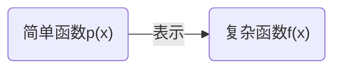

# 函数逼近的基本概念

初始想法



函数的性质包括：连续性、收敛性和可导性等。

> [!warning]
>
> 实际应用中无法找到函数$f(x)$。

**要求：**$\left |f(x)-p(x)  \right |$尽可能小（或足够的小$\ne$无限的小）。

## N维空间

数学上常把在各种集合中，引⼊某些不同的确定关系，称为赋予集合以某种空间结构，并将这样的集合称为空间。维空间对某些运算封闭。

1. 多项式空间：$P_n(x)$在$H_n$上对加法和乘法封闭

$$
H_n \triangleq \left \{ P_n(x), +, \times \right \}
$$

2. 线性空间：所有$[a,b]$区间上所有的连续函数$f(x)$对加法和数乘封闭

$$
C[a,b]\triangleq \left \{ [a,b] \text{区间上的连续函数}, +, \text{数乘} \right \}
$$

表示闭区间$[a,b]$上所有连续函数构成的空间。

3. $p$阶连续导数的函数空：所有$[a,b]$区间上所有的$p$阶导函数对加法和数乘封闭

$$
C^{(p)}[a,b]\triangleq \left \{ [a,b] \text{区间上具有}p\text{阶连续导数的函数}, +, \text{数乘} \right \}
$$

> [!warning]
>
> N维空间虽然无法看见，但是可以研究其性质。N维空线性空间只是N维空间的一种。

**定理**

设$f(x)\in C[a,b]$，则对任意$\epsilon >0$，总存在多项式$p(x)$，使得
$$
\left \| p(x)-f(x) \right \|_{\infty} < \epsilon 
$$
在$[a, b]$上一致成立。

> [!warning]
>
> 一致成立：表示在$[a, b]$上整体成立，且成立的方式是一致的，不依赖于点的选择。

## 范数

设$S$为线性空间

1. 正定性：$\left \| x \right \| \ge0$，当且仅当$x=0$时，$\left \| x \right \| =0$。
2. 其次性：$\left \| \alpha x \right \| = \left | \alpha  \right | \left \| x \right \|$，$\alpha\in R$。
3. 三角不等式：$\left \| x+y \right \| \le \left \| x \right \|+\left \| y \right \|$，$x,y\in S$

$\left \| \bullet  \right \|$为$S$上的范数，$S$与$\left \| \bullet  \right \|$称为赋范线性空间。

> [!warning]
>
> 范数的作用可以对向量、矩阵和函数进行量化。

### 向量的范数

向量的精确值表示为$x=\left \{ x_1, x_2, … \right \} $，向量的近似值表示为$\tilde{x}  =\left \{ \tilde{x}_1  , \tilde{x} _2, … \right \} $

> [!note]
>
> 1. 如何判断向量$\tilde{x}$的精确程度？
> 2. 如何衡量向量$x-\tilde{x}$的大小？

设$R^n$为$n$维实向量集，向量的范数$N(x)=\left \| x \right \| $是定义在$R^n$上的实值函数，对于$\forall x\in R$满足正定性、其次性和三角不等式，则称$N(x)$是$R^n$上的一个向量范数（或模）。

向量的常用范数

1. 向量的$\infty$—范数（最大范数）

$$
\left \| x \right \|_{\infty }=\max_{1\le i\le n} \left | x_i \right |
$$

2. 向量的1—范数

$$
\left \| x \right \|_{1}=\sum_{i=1}^n \left | x_i \right |
$$

3. 向量的2—范数（欧式范数）

$$
\left \| x \right \|_{2}=(x,x)^{\frac{1}{2}}=\left ( \sum_{i=1}^n  x_i^2 \right )^{\frac{1}{2}}
$$

4. 向量的$p$—范数

$$
\left \| x \right \|_{p}=\left ( \sum_{i=1}^n  \left | x_i \right |^p  \right )^{\frac{1}{p}}
$$

其中1，2，$\infty$范数是$p$—范数的特殊情况
$$
\lim_{p \to \infty} \left \| x \right \|_{p}=\lim_{p \to \infty}\left ( \sum_{i=1}^n  \left | x_i \right |^p  \right )^{\frac{1}{p}}=\max_{1\le i\le n} \left | x_i \right |
$$
其中利用公式$\lim_{n \to \infty} \sqrt[n]{n} =1$

> [!Note]
>
> 计算向量$x=(1, -2, 3)^T$的各种范数。

$$
\left \| x \right \|_{1 }=6,\quad  \left \| x \right \|_{2}=\sqrt{14} ,\quad\left \| x \right \|_{\infty }=3
$$

```python
import numpy as np

x = np.array([1, -2, 3])

# 计算各种范数
l1_norm = np.linalg.norm(x, ord=1)    # L1 范数
l2_norm = np.linalg.norm(x, ord=2)    # L2 范数
linf_norm = np.linalg.norm(x, ord=np.inf)  # L∞ 范数

print(f"L1 范数: {l1_norm}")
print(f"L2 范数: {l2_norm}")
print(f"L∞ 范数: {linf_norm}")
```

### 矩阵的范数

设矩阵$A\in R^{n\times n}$实矩阵集合，矩阵范数$N(A)=\left \| A \right \|$是定义在$R^{n\times n}$上的非负的实值函数，它满足

1. 正定性：$\left \| A \right \| \ge0$（$\left \| A \right \| =0 \Leftrightarrow A=0$）

2. 齐次性：$\left \|k A \right \| =\left | k \right | \left \|A \right \|$ ，$k\in R$
3. 三角不等式：$\left \|A+B \right \| \le  \left \|A \right \|+\left \|B \right \|$
4. 乘积不等式：$\left \|AB \right \| \le  \left \|A \right \|\left \|B \right \|$

称$\left \| A \right \|$为矩阵的范数。

矩阵的常用范数

1. 矩阵$A$的列范数

$$
\left \|A \right \|_1=\max_{1\le j\le n} \sum_{i=1}^n\left | a_{ij}  \right |
$$

2. 矩阵$A$的行范数

$$
\left \|A \right \|_\infty =\max_{1\le i\le n} \sum_{j=1}^n\left | a_{ij}  \right |
$$

3. 矩阵$A$的$E$范数

$$
\left \|A \right \|_E =\sqrt{\sum_{i,j=1}^n a_{ij}^2}
$$

4. 矩阵$A$的普范数

$$
\left \|A \right \|_2 =\sqrt{\lambda_{\max}(A^TA)}
$$

其中$\lambda_{\max}(A^TA)$表示$A^TA$的最大特征值。

矩阵范数的说明

* 当向量范数和矩阵范数同时出现时，默认它们是相容的$\left \|Ax \right \|\le \left \|A \right \|\left \|x \right \|$
* 对于$n\times n$的单位矩阵$I$有$\left \|I\right \|_p=1$，$p=1, 2, \infty$，$\left \|I\right \|_E=\sqrt{n}$
* 对于实对称矩阵$A$，$\left \|A\right \|_2=\max_{1\le i \le n}\left | \lambda_i  \right | $，其中$\lambda_i$是$\sqrt{A^2}$的最大特征值。

> [!Note]
>
> 计算矩阵的各个范数

$$
A=
\begin{pmatrix}
4&  3 \\
-1&  6
\end{pmatrix}
$$

列范数
$$
\left \|A \right \|_1=\max_{1\le j\le n} \sum_{i=1}^n\left | a_{ij}  \right |=9
$$
行范数
$$
\left \|A \right \|_\infty =\max_{1\le i\le n} \sum_{j=1}^n\left | a_{ij}  \right |=7
$$
$E$范数
$$
\left \|A \right \|_E =\sqrt{\sum_{i,j=1}^n a_{ij}^2}=7.87401
$$
谱范数
$$
A^TA=
\begin{pmatrix}
17&  6 \\
6&  45
\end{pmatrix}
$$
特征方程
$$
\left | \lambda I-A^TA  \right | 
=
\begin{vmatrix}
\lambda-17  & -6 \\
-6 & \lambda-45
\end{vmatrix}
=0
$$
可得
$$
\lambda^2-62\lambda+729=0 \Rightarrow  \lambda_{max}\approx 46.23
$$
带入范数公式
$$
\left \|A \right \|_2 =\sqrt{\lambda_{\max}(A^TA)}\approx 6.8
$$

```python
import numpy as np

A = np.array([[4, 3],
              [-1, 6]])

col_norm = np.linalg.norm(A, ord=1) # 计算列范数
row_norm = np.linalg.norm(A, ord=np.inf) # 计算行范数 
frobenius_norm = np.linalg.norm(A, ord='fro') # E 范数
spectral_norm = np.linalg.norm(A, ord=2) # 计算谱范数 

print(f"列范数 (L1 范数): {col_norm}")
print(f"行范数 (L∞ 范数): {row_norm}")
print(f"E范数: {frobenius_norm}")
print(f"谱范数 (L2 范数): {spectral_norm}")
```

### 函数的范数

设函数$f(x)\in C[a,b]$，函数范数$\left \| A \right \|$满足以下性质：

1. 正定性：$\left \| f \right \| \ge0$（$\left \| f \right \| =0 \Leftrightarrow f(x)=0$，$x\in D$）
2. 齐次性：$\left \|k f \right \| =\left | k \right | \left \|f \right \|$，$k\in R$
3. **三角不等式**：$\left \|f+g \right \| \le  \left \|f \right \|+\left \|g \right \|$

对于区间$[a,b]$，常用的三种范数如下

1. 函数的$\infty$—范数

$$
\left \| f \right \|_{\infty }=\max_{a\le x\le b} \left | f(x) \right |
$$

2. 函数的1—范数

$$
\left \| f \right \|_{1 }=\int_{a}^{b} \left | f(x) \right | \mathrm{d}x
$$

3. 函数的2—范数

$$
\left \| f \right \|_{2}=\sqrt{\int_{a}^{b}  f^2(x)  \mathrm{d}x }
$$

> [!note]
>
> $f(x)=(x-1)^2$关于$C[0, 1]$的1-范数，2-范数和无穷范数。

$$
\begin{array}{lll}
\left \| f \right \|_{1 }=\int_{0}^{1} \left | f(x) \right | \mathrm{d}x=\int_{0}^{1}(x-1)^2=\frac{1}{3}\\
\\
\left \| f \right \|_{2}=\left ( \int_{0}^{1}  f^2(x)  \mathrm{d}x \right ) ^{\frac{1}{2}}=\left ( \int_{0}^{1} (x-1)^4  \mathrm{d}x \right ) ^{\frac{1}{2}}=\frac{1}{\sqrt{5} } \\
\\
\left \| f \right \|_{\infty }=\max_{a\le x\le b} \left | f(x) \right |=f(0)=1
\end{array}
$$

## 内积与内积空间

N维数量空间的内积
$$
(x,y)=x_1y_1+x_2y_2+…+x_ny_n
$$
例如：在三维空间中，向量表示为
$$
\overrightarrow{X}=\left \{ x_1, x_2, x_3\right \}, \quad \overrightarrow{y}=\left \{ y_1, y_2, y_3\right \}
$$
点乘可以表示为
$$
\overrightarrow{X}\cdot \overrightarrow{Y}=x_1y_1+x_2y_2+x_3y_3
$$
在N维空间中向量的方向无意义，所以N维空间的内容表示为$(x,y)$。

设$X$是数域$K$（$R$或$C$）上的线性空间，对$\forall u,v\in X$，有$K$中一个数与之对应，记为$(u,v)$，它满足以下条件：

1. $(u,v)=\overline{(v,u)} $
2. $(\alpha u,v)=\alpha(u,v)$，$\alpha \in K$
3. $(u+v,w)=(u,w)+(v,w)$，$\forall u,v,w\in X$
4. $(u,v)\ge 0$，当且仅当$u=0$时，$(u,u)=0$

则称$(u,v)$为$X$上$u$与$v$的内积，定义了内积的线性空间称为内积空间。

> [!warning]
>
> $(u,v)=\overline{(v,u)}$表示共轭，当$K$实数域时，表示为$(u,v)=(v,u)$

上面的向量点乘只是内积的一种定义，例如
$$
(f,g)=\int_{a}^{b}f\cdot g\mathrm{d}x
$$
也可以定义为内积。

**定理**

设$X$为一内积空间，$\forall u,v\in X$，有
$$
\left | (u,v) \right |^2\le(u,u) (v,v)
$$
即
$$
(x_1y_1+x_2y_2+…+x_ny_n)^2\le \sqrt{x_1^2+x_3^2+…+x_n^2} \sqrt{y_1^2+y_3^2+…+y_n^2}
$$
称其为柯西-施瓦茨（Cauchy -Schwarz）不等式。

**定理**

设$X$为一内积空间，$u_1, u_2, …, u_n\in X$，矩阵
$$
G=
\begin{pmatrix}
(u_1,u_1)  &  (u_2,u_1)  & … & (u_n,u_1)\\
(u_1,u_2)  & (u_2,u_2)  & … & (u_n,u_2)\\
 … & … & … & …\\
(u_1,u_n)  &(u_2,u_n)  & … & (u_n,u_n)\\
\end{pmatrix}
$$
称为格拉姆（Gram）矩阵，矩阵G非奇异的充分必要条件是$u_1, u_2, …, u_n$线性无关。

## 最佳逼近

设函数$f(x)$是区间$[a,b]$上的连续函数，对于任意给定$\forall \epsilon \ge 0$，如果存在多项式$P(x)$，使得不等式
$$
\max_{a\le x \le b} \left | f(x)-P(x) \right | < \epsilon
$$
成立，则称$P(x)$在区间$[a,b]$上一致逼近（或均匀逼近）于函数$f(x)$。

对于$f(x)\in C[a,b]$，求多项式$p_n^*(x)\in H_n$，使得误差
$$
\left \| f(x)-p^*_n(x) \right \|_{\infty }=\min_{p_n\in H_n} \left \| f(x)-p_n(x) \right \|_{\infty}
$$
则称$p_n^*(x)$为$f(x)$在$[a, b]$上的最优一致逼近多项式。其中，$H_n$代表全体多项式构成的结合。

