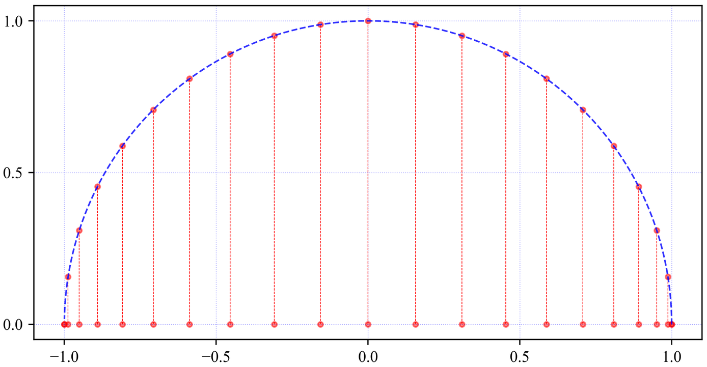

# 正交多项式

设函数$f(x)$是区间$[a,b]$上的连续函数，对于任意给定$\forall \epsilon \ge 0$，如果存在多项式$P(x)$，使得不等式
$$
\max_{a\le x \le b} \left | f(x)-P(x) \right | < \epsilon
$$
成立，则称$P(x)$在区间$[a,b]$上一致逼近（或均匀逼近）于函数$f(x)$。

> [!warning]
>
> 上面的范数实际上是函数$g(x)=f(x)-P(x) $的范数，而不是直接定义在两个函数上的范数。

对于$f(x)\in C[a,b]$，求多项式$P_n^*(x)\in H_n$，$H_n$代表全体多项式构成的结合，使得误差
$$
\left \| f(x)-P^*_n(x) \right \|=\min_{P_n\in H_n} \left \| f(x)-P_n(x) \right \|
$$
则称$P_n^*(x)$为$f(x)$在$[a, b]$上的最佳逼近多项式。

最佳逼近多项式的三重含义：

1. 一个连续函数$f(x)$定义在区间$[a, b]$上，希望用一个多项式$P_n(x)$来近似这个函数。选择一个选择一个多项式集合$H_n$，作为逼近空间。
1. $f(x)$和$P_n(x)$的差异用范数来描述，可以是2-范数、无穷范数等。
1. 在所有满足$P_n\in H_n$的多项式中，希望找到一个多项式$P^*_n(x)$使得误差最小，这个$P^*_n(x)$就是最佳逼近。

> [!warning]
>
> 在函数逼近问题中，正交多项式起到了构造最佳逼近多项式、降低数值误差以及提高计算稳定性的作用。

## 正交多项式的概念

若$f(x),g(x)\in C[a,b]$，且
$$
\left(f(x),g(x)\right)=\int_{b}^{a}f(x)g(x)\mathrm{d}x=0
$$
则称$f(x)$和$g(x)$在$[a,b]$上正交。

若函数$\varphi_0(x),\varphi_1(x),……,\varphi_n(x)$满足关系
$$
(\varphi_j(x),\varphi_k(x))
=\int_{b}^{a}\varphi_j(x)\varphi_k(x)\mathrm{d}x
=
\left\{\begin{matrix}
0 & j\ne k\\
A_k>0 & j=k
\end{matrix}\right.
$$
则称$\left \{ \varphi_k(x)\right \} $是$[a,b]$上的正交函数系。若$A_k\equiv 0$，则称为标准正交函数系。

若$f(x),g(x)\in C[a,b]$，$w(x)$是$[a,b]$上的权函数且满足
$$
\left(f(x),g(x)\right)=\int_{b}^{a}w(x)f(x)g(x)\mathrm{d}x=0
$$
则称$f(x)$与$g(x)$在$[a,b]$上带权$w(x)$正交。

若函数$\varphi_0(x),\varphi_1(x),……,\varphi_n(x)$满足关系
$$
(\varphi_j(x),\varphi_k(x))
=\int_{b}^{a}w(x)\varphi_j(x)\varphi_k(x)\mathrm{d}x
=
\left\{\begin{matrix}
0 & j\ne k\\
A_k>0 & j=k
\end{matrix}\right.
$$
则称$\left \{ \varphi_k(x)\right \} $是$[a,b]$上带权$w(x)$的正交函数系。若$A_k\equiv 0$，则称为标准正交函数系。

例如：三角函数族
$$
1,\cos x,\sin x, \cos 2x, \sin 2x …
$$
为$[-\pi, \pi]$上的正交函数族。

1. 任意两个不同函数在$[-\pi, \pi]$上积分为0。根据积化和差公式可以证明

$$
\begin{array}{lll} 
\int_{-\pi}^{\pi}\cos nx\mathrm{d}x=0 \\
\int_{-\pi}^{\pi}\sin nx\mathrm{d}x=0 \\
\int_{-\pi}^{\pi}\cos mx\sin nx\mathrm{d}x=0 \\
\int_{-\pi}^{\pi}\cos mx\cos nx\mathrm{d}x=0 \\
\int_{-\pi}^{\pi}\sin mx\sin nx\mathrm{d}x=0 \\
\end{array}
$$

2. 任意两个相同函数$[-\pi, \pi]$上积分为$\pi$

$$
\begin{array}{lll} 
\int_{-\pi}^{\pi}\cos m\cos n\pi\mathrm{d}x=
\left\{\begin{matrix}
0 & m \ne n \\
\pi & m = n
\end{matrix}\right.
\\
\int_{-\pi}^{\pi}\sin m\sin n\pi\mathrm{d}x=
\left\{\begin{matrix}
0 & m \ne n \\
\pi & m = n
\end{matrix}\right.
\end{array} 
$$

所以有
$$
\begin{array}{lll} 
(1, 1)=2\pi \\
(\cos kx, \cos kx)=(\sin kx, \sin kx)=\pi  \\
\text{其他=0} 
\end{array} 
$$
> [!warning]
>
> 区间$[a,b]$上的正交函数系必定线性无关

## 正交多项式的构造

给定区间$[a,b]$及权函数$w(x)$，均由一族线性无关的幂函数${1, x, …, x^n}$，利用逐个正交化手续立得正交多项式序列
$$
\begin{array}{lll} 
\varphi_0(x)=1  \\
\varphi_n(x)=
x^n-\sum_{j=0}^{n-1}\frac{(x^n,\varphi_j(x))}{(\varphi_j(x),\varphi_j(x))}\varphi_j(x) & n=1,2,… 
\end{array}
$$

> [!warning]
>
> 可以理解为从一组简单的幂函数出发，通过逐步去除它们之间的“重叠部分”（即投影），构造出一组在给定权函数下彼此正交的多项式。

当$[a,b]=[0,1]$时可以构造正交多项式如下
$$
\begin{array}{lll} 
\varphi_0(x)=1 \\ 
\varphi_1(x)=x-\frac{(x,1)}{(1,1)} =x-\frac{1}{2} \\
\varphi_2(x)=
x^2-\frac{(x,1)}{(1,1)}\times 1-
\frac{(x^2,x-\frac{1}{2})}{(x-\frac{1}{2},x-\frac{1}{2})}(x-\frac{1}{2})=x^2-x+\frac{1}{6} 
\end{array}
$$
性质

1. $\left \{ \varphi_0(x),\varphi_1(x),……,\varphi_n(x) \right \} $线性无关。
2. 对$\forall P_n(x)\in H_n$均可表示为$\varphi_0(x),\varphi_1(x),……,\varphi_n(x)$的线性组合。
3. 当$k\ne j$时，$(p_j,p_k)=0$且$p_k(x)$与任一次小于k的多项式正交。
4. 递推关系成立

$$
\varphi_{n+1}(x)=(x-\alpha_n)\varphi_{n}(x)-\beta_n\varphi_{n-1}(x) \quad n=1,2,…
$$

其中
$$
\begin{array}{lll} 
\varphi_0(x)=1, \quad  \varphi_{-1}(x)=0 \\
\alpha_n=\frac{(x\varphi_n(x),\varphi_n(x))}{(\varphi_n(x),\varphi_n(x))} \\
\beta_n=\frac{(\varphi_n(x),\varphi_n(x))}{(\varphi_{n-1}(x),\varphi_{n-1}(x))}
\end{array}
$$

5. $\varphi_n(x)$在$[a,b]$内有$n$个单重实根。

使用程序构造正交多项式

```python
import sympy as sp

def gram_schmidt_orthogonalization(n, a, b, w):
    x = sp.Symbol('x')
    basis = [x**i for i in range(n+1)]  # 幂函数 {1, x, x^2, ..., x^n}
    ortho_poly = []
    
    def inner_product(f, g):
        return sp.integrate(f * g * w, (x, a, b))
    
    for i in range(n+1):
        phi_i = basis[i]
        for phi_j in ortho_poly:
            coeff = inner_product(basis[i], phi_j) / inner_product(phi_j, phi_j)
            phi_i -= coeff * phi_j
        ortho_poly.append(sp.simplify(phi_i))
    
    return ortho_poly

a, b = 0, 1  # 定义区间
w = 1  # 权函数 w(x) = 1
n = 6  # 计算到 x^3 的正交多项式

ortho_polynomials = gram_schmidt_orthogonalization(n, a, b, w)

for i, poly in enumerate(ortho_polynomials):
    print(f'ϕ_{i}(x) = {poly}')
```

绘制上面多项式图像

```python
import matplotlib.pyplot as plt

x = sp.Symbol('x')
plt.figure(figsize=(10, 6))
x_vals = np.linspace(a, b, 400)
for i, poly in enumerate(ortho_polynomials):
    if i == 0:
        continue
    numpy_func = sp.lambdify(x, poly, 'numpy')
    y_vals = numpy_func(x_vals)
    plt.plot(x_vals, y_vals,  label=fr'$\phi_{i}(x)$')

plt.title(f'Orthogonal Polynomials on [{a}, {b}] with $w(x) = {w}$', fontsize=14)
plt.xlabel('x', fontsize=12)
plt.ylabel('ϕ(x)', fontsize=12)
plt.grid(True, linestyle='--', alpha=0.7)
plt.legend(loc='upper left', fontsize=10)
plt.show()
```

## 常用的正交多项式系

### 勒让德多项式

当$[a,b]=[-1,1]$，权函数$w(x)\equiv1$时，由${1, x, …, x^n}$正交化得到的多项式为式勒让德多项式。

* 专用符号$P_0(x),P_1(x),…,P_n(x)$。

* 罗德里格公式为

$$
P_n(x)=
\frac{1}{2^nn!}\cdot
\frac{\mathrm{d}^n }{\mathrm{d} x^n}\left [ \left (x^2-1\right )^n\right],
\quad n=0,1,2,…
$$

​	其首项系数为
$$
a_n=
\frac{2n(2n-1)…(n-1)}{2^nn!}=
\frac{(2n)!}{2^n(n!)^2}
$$
首项系数为$1$的勒让德多项式为
$$
\tilde{P}_n(x)=
\frac{n!}{(2n)!}\cdot 
\frac{\mathrm{d}^n }{\mathrm{d} x^n}\left [ \left (x^2-1\right )^n\right],
\quad n=0,1,2,…
$$
勒让德多项式的性质

1. 正交性

$$
\int_{-1}^{1}P_n(x)P_m(x)dx=
\left\{\begin{matrix}
0  & m\ne n \\
\frac{2}{2n+1} & m=n
\end{matrix}\right.
$$

2. 奇偶性

$$
P_n(-x)=(-1)^nP_n(x)
$$

3. $P_n(x)$在$(-1, 1)$内部有$n$个互异的实零点。

4. 递推关系式

$$
\left\{\begin{matrix}
P_0(x)=1, \quad P_1(x)=x \\
P_{n+1}(x)=\frac{2n+1}{n+1}xP_n(x)-\frac{n}{n+1} P_{n-1}
\end{matrix}\right.
\qquad n=1, 2, …
$$

根据递推公式可得
$$
\begin{array}{lll} 
P_2(x)=\frac{1}{2}(3x^2-1)  \\
P_3(x)=\frac{1}{2}(5x^3-3x) 
\end{array}
$$

使用程序生成多项式并绘制图像

```python
x = sp.Symbol('x')

def legendre_poly(n):
    if n == 0:
        return 1
    elif n == 1:
        return x
    else:
        return sp.simplify(((2 * (n - 1) + 1) * x * legendre_poly(n - 1) - (n - 1) * legendre_poly(n - 2)) / n)

legendre_polynomials = [legendre_poly(n) for n in range(6)]

for n, poly in enumerate(legendre_polynomials):
    print(f"P_{n}(x) =", poly)

x_vals = np.linspace(-1, 1, 400)
plt.figure(figsize=(8, 6))

for n, poly in enumerate(legendre_polynomials):
    if n == 0:
        continue
    y_vals = np.array([poly.subs(x, val) for val in x_vals], dtype=np.float64)
    plt.plot(x_vals, y_vals, label=f"$P_{n}(x)$")

plt.xlabel('x', fontsize=12)
plt.ylabel('$T_n(x)$', fontsize=12)
plt.grid(True, linestyle='--', alpha=0.7)
plt.legend(loc='upper left', fontsize=10)
plt.ylim(-1.5, 1.5)  
plt.show()
```

### 切比雪夫多项式

> [!warning]
>
> 切比雪夫多项式时应用最广泛的一种正交多项式系。

当$[a,b]=[-1,1]$，权函数
$$
w(x)=\frac{1}{\sqrt{1-x^2}}
$$
时，由${1, x, …, x^n}$正交化得到的多项式为式切比雪夫多项式，专用符号$T_0(x),T_1(x),…,T_n(x)$。它可表示为
$$
T_n(x)=\cos(n\arccos x),\quad -1\le x \le 1, \quad n=0,1,2,…
$$
若令$x=\cos\theta$，则$T_n(x)=\cos(n\theta)$，$0\le\theta \le \pi $，利用多倍角公式
$$
\begin{array}{lll} 
T_0(x)=\cos(0)=1 \\
T_1(x)=\cos(\arccos x)=\cos\theta=x \\
T_2(x)=\cos(2\arccos x)=\cos2\theta=2\cos^2\theta-1=2x^2-1 \\
T_3(x)=4x^3-3x \\
…
\end{array}
$$
切比雪夫多项式的性质

1. 正交性

$$
\int_{-1}^{1}\frac{T_m(x)T_n(x)}{\sqrt{1-x^2}}\mathrm{d}x
=\left\{\begin{matrix}
0  & m\ne n \\
\frac{\pi }{2}   & m=n\ne0  \\
\pi   & m=n=0  \\
\end{matrix}\right.
$$

2. 奇偶性。$T_{2n}(x)$只含有$x$偶数项，$T_{2n+1}(x)$只含有$x$奇数项。

3. 递推公式

$$
\left\{\begin{matrix}
T_0(x)=1, \quad T_1(x)=x \\
T_{n+1}(x)=2xT_n(x)-T_{n-1}
\end{matrix}\right.
$$

​	$T_n(x)$的最高次幂$x^n$的系数为$2^{n-1}$，$n\ge1$

4. $T_n(x)$在$[-1, 1]$内部有$n$个不同的零点	

$$
x_k=\cos\frac{(2k-1)\pi}{2n}\quad k=1, 2,…,n
$$



5. $T_n(x)$在$[-1, 1]$上有$n+1$个不同的极值点

$$
{x}'_k=\cos\frac{k\pi}{2n}\quad k=1, 2,…,n
$$

​	轮流取得最大值$1$和最小值$-1$，$\left\{{x}'_k\right\}$称为交错点组。

使用余弦形式生成切比雪夫多项式

```python
x = sp.Symbol('x')

def chebyshev_polynomial(n):
    return sp.cos(n * sp.acos(x))

n_values = range(6)
chebyshev_polynomials = [chebyshev_polynomial(n) for n in n_values]

for n, T_n in enumerate(chebyshev_polynomials):
    print(f'T_{n}(x) = {sp.simplify(T_n)}')

x_vals = np.linspace(-1, 1, 400)  # 定义区间 [-1, 1] 内的点
T_n_funcs = [sp.lambdify(x, T_n, 'numpy') for T_n in chebyshev_polynomials]

plt.figure(figsize=(10, 6))
colors = ['blue', 'green', 'red', 'purple', 'orange', 'brown']

for n, T_n_func in enumerate(T_n_funcs):
    if n == 0:
        continue
    y_vals = T_n_func(x_vals)
    plt.plot(x_vals, y_vals, label=fr'$T_{n}(x)$')

plt.title('Chebyshev Polynomials $T_0(x)$ to $T_5(x)$', fontsize=14)
plt.xlabel('x', fontsize=12)
plt.ylabel('$T_n(x)$', fontsize=12)
plt.grid(True, linestyle='--', alpha=0.7)
plt.legend(loc='upper left', fontsize=10)
plt.ylim(-1.5, 1.5)  
plt.show()
```

使用递推关系式生成切比雪夫多项式

```python
x = sp.Symbol('x')

def chebyshev_poly(n):
    if n == 0:
        return 1
    elif n == 1:
        return x
    else:
        return 2 * x * chebyshev_poly(n - 1) - chebyshev_poly(n - 2)

chebyshev_polynomials = [chebyshev_poly(n) for n in range(6)]

for n, poly in enumerate(chebyshev_polynomials):
    print(f"T_{n}(x) =", sp.simplify(poly))

x_vals = np.linspace(-1, 1, 400)
plt.figure(figsize=(10, 6))

for n, poly in enumerate(chebyshev_polynomials):
    if n == 0:
        continue
    y_vals = np.array([poly.subs(x, val) for val in x_vals], dtype=np.float64)
    plt.plot(x_vals, y_vals, label=f"$T_{n}(x)$")

plt.xlabel('x', fontsize=12)
plt.ylabel('$T_n(x)$', fontsize=12)
plt.grid(True, linestyle='--', alpha=0.7)
plt.legend(loc='upper left', fontsize=10)
plt.ylim(-1.5, 1.5)  
plt.show()
```

**定理**

设$\widetilde{T}_n(x)$是首项系数为1的切比雪夫多项式，则
$$
\max_{-1\le x\le 1}\left | \widetilde{T}_n(x) \right | \le 
\max_{-1\le x\le 1}\left | P(x) \right |,
\quad \forall P(x)\in \widetilde{H}_n
$$
且
$$
\max_{-1\le x\le 1}\left | \widetilde{T}_n(x) \right | 
=\frac{1}{2^{n-1}}
$$
定理核心含义：首项系数为1的切比雪夫多项式在所有同类多项式中，具有最小的最大绝对值。

> [!note]
>
> 求$f(x)=2x^3+x^2+2x-1$在$[-1, 1]$的最佳2次逼近多项式。

根据题意所求最佳逼近多项式$P^*(x)$应该满足
$$
\max_{-1\le x \le 1} \left | f(x)-P^*_2(x) \right | = \min
$$
由上述定理可知，逼近函的截断高次项为
$$
f(x)-P^*_2(x)=\frac{1}{2}T_3(x)=2x^3-\frac{3}{2}x
$$
多项式$f(x)-P^*_2(x)$与零偏差最小，故
$$
P^*_2(x)=f(x)=\frac{1}{2}T_3(x)=x^2+\frac{7}{2}x-1  
$$
即为$f(x)$在$[-1, 1]$的最佳2次逼近多项式。

### 切比雪夫多项式零点插值

> [!note]
>
> 设$f(x)\in C^{(n+1)}$且存在$n+1$阶连续导数$f^{(n+1)}(x)$，如何在$[-1,1]$上确定互异的插值节点$x_0,x_1,…,x_n$，使得$f(x)$的$n$次插值多项式的余项最小？

由插值余项定理$n$次插值多项式$L_n(x)$的余项为
$$
R_n(x)=f(x)-L_n(x)
=\frac{f^{(n+1)}(\xi)}{(n+1)!}w_{n+1}(x)
$$
其中
$$
w_{n+1}(x)=\prod_{i=0}^{n}(x-x_i), \quad \xi \in (-1,1)
$$
估计余项可以表示为
$$
\begin{aligned} 
\left | f(x)-L_n(x) \right | 
&\le\frac{1}{(n+1)!}\max_{-1\le x \le 1} \left | f^{(n+1)}(x) \right | 
\max_{-1\le x \le 1} \left | w_{n+1}(x) \right | \\
&=\frac{1}{(n+1)!}\left \| f^{(n+1)}(x) \right \|_{\infty}\left \|w_{n+1}(x) \right \|_{\infty} 
\end{aligned}
$$
要使余项达到最小，$\left \|w_{n+1}(x) \right \|_{\infty}$尽可能的小，注意到$w_{n+1}(x)$是首项系数为1的$n+1$的多项式。当$\left \|w_{n+1}(x) \right \|_{\infty}=\widetilde{T}_n(x)$即可。故只需要$x_i$，$i=0,1,2,…,n$次切比雪夫0点，即
$$
x_k=\frac{(2k+1)\pi}{2(n+1)}, \quad k=0,1,2…,n
$$
使得$\max_{-1\le x \le 1} \left | w_{n+1}(x) \right |$取得极小值$\frac{1}{2^n} $。

**定理**

设插值节点$x_0,x_1,…,x_n$为切比雪夫多项式$T_{n+1}(x)$的零点，被插函数$f(x)\in C^{(n+1)}[-1,1]$，$L_n(x)$为相应的$n$次插值多项式，则
$$
\max_{-1\le x \le 1} \left |f(x)-L_n(x) \right | 
\le \frac{1}{2^n(n+1)!} \left \| f^{(n+1)}(x) \right \|_{\infty} 
$$
一般地$f(x)\in C^{(n+1)}[a,b]$，则函数通过
$$
x=\frac{a+b}{2}+\frac{b-a}{2}t
$$
化为
$$
f(x)=f(\frac{a+b}{2}+\frac{b-a}{2}t)=g(t), \quad -1\le t \le 1
$$
插值节点
$$
t_k=\cos \frac{(2k+1)\pi}{2(n+1)} \Rightarrow 
x_k=\frac{a+b}{2}+\frac{b-a}{2}\cos \frac{(2k+1)\pi}{2(n+1)}, 
\quad k=0,1,2,…,n
$$
能使$\max_{a\le x\le b}R_n(x)$达到极小，并有
$$
\begin{aligned} 
\max_{a\le x\le b}R_n(x) 
&\le\frac{M_{n+1}}{(n+1)!}\max \left |(x-x_0)(x-x_1)…(x-x_n) \right | \\
&=\frac{M_{n+1}}{(n+1)!}\frac{(b-a)^{n+1}}{2^{n+1}} \max_{-1\le t \le 1} \left |(t-t_0)(t-t_1)…(t-t_n) \right| \\ 
&=\frac{M_{n+1}}{(n+1)!}\frac{(b-a)^{n+1}}{2^{n+1}}\max_{-1\le t \le 1}\left | \frac{1}{2^n}T_{n+1}(t) \right| \\
&=\frac{M_{n+1}}{(n+1)!}\frac{(b-a)^{n+1}}{2^{2n+1}}  
\end{aligned}
$$

> [!note]
>
> 求$f(x)=e^x$，在$[0,1]$上的四次拉格朗日插值多项式$L_4(x)$，插值节点用$T_5(x)$的零点，并估计$\max_{0 \le x \le 1}\left | e^x-L_4(x) \right|$

插值节点
$$
\begin{aligned} 
x_k
&=\frac{a+b}{2}+\frac{b-a}{2}\cos\frac{(2k+1)\pi}{2(n+1)}  \\  
&=\frac{1}{2}\left ( 1+\cos \frac{2k+1}{10}\pi\right )  
\end{aligned}
\quad k=0,1,2,3,4
$$
即
$$
\begin{matrix}
x_0=0.97553 & x_1=0.79390 & x_2=0.20611 \\
x_3=0.20611 & x_4=0.02447 &
\end{matrix}
$$
得到
$$
L_4(x)=1.00002274+0.99886233x+0.50902251x^2+0.14184105x^3+0.06849435x^4
$$
利用
$$
\max_{0\le x\le 1} \left | e^x-L_4(x) \right | \le 
\frac{M_{n+1}}{(n+1)!}\frac{(b-a)^{n+1}}{2^{2n+1}}, 
\quad n=4
$$
得到
$$
\max_{0\le x\le 1} \left | e^x-L_4(x) \right | \le 
\frac{e}{5!}\frac{1}{2^9}<4.4\times 10^{-5}
$$
函数
$$
f(x)=\frac{1}{1+x^2}, \quad x\in [-5, 5]
$$
上利用$T_{11}(x)$的零点为插值节点的10次拉格朗日插值多项式$\widetilde{L}_{10}(x)$与等距节点的$L_{10}(x)$以及$f(x)$作比较

```python
from scipy.interpolate import lagrange

# 目标函数
def f(x):
    return 1 / (1 + x**2)

# 生成 Chebyshev 节点
def chebyshev_nodes(n, a, b):
    k = np.arange(n)
    x_cheb = np.cos((2*k + 1) / (2*n) * np.pi)  # 计算 [-1,1] 上的 Chebyshev 节点
    return 0.5 * (a + b) + 0.5 * (b - a) * x_cheb  # 映射到 [a, b]

# 区间范围
a, b = -5, 5
n = 10

# 生成等距节点和 Chebyshev 节点
x_uniform = np.linspace(a, b, n+1)
x_chebyshev = chebyshev_nodes(n+1, a, b)

# 计算 y 值
y_uniform = f(x_uniform)
y_chebyshev = f(x_chebyshev)

# 计算拉格朗日插值多项式
lagrange_uniform = lagrange(x_uniform, y_uniform)      # 等距插值
lagrange_chebyshev = lagrange(x_chebyshev, y_chebyshev)  # Chebyshev 插值

# 生成绘图点
x_vals = np.linspace(a, b, 500)
y_true = f(x_vals)  # 真实函数值
y_uniform_interp = lagrange_uniform(x_vals)  # 等距插值值
y_chebyshev_interp = lagrange_chebyshev(x_vals)  # Chebyshev 插值值

# 计算误差
error_uniform = np.abs(y_true - y_uniform_interp)
error_chebyshev = np.abs(y_true - y_chebyshev_interp)

# 绘图
plt.figure(figsize=(10, 6))
plt.plot(x_vals, y_true, 'k-', label=r'$f(x) = \frac{1}{1+x^2}$', linewidth=2)
plt.plot(x_vals, y_uniform_interp, 'r--', label=r'$L_{10}(x)$', linewidth=2)
plt.plot(x_vals, y_chebyshev_interp, 'b-.', label=r'$\tilde{L}_{10}(x)$', linewidth=2)
plt.scatter(x_uniform, y_uniform, c='red', label="equal nodes", marker='o')
plt.scatter(x_chebyshev, y_chebyshev, c='blue', label="Chebyshev nodes", marker='x')
plt.xlabel("x")
plt.ylabel("f(x)")
plt.legend()
plt.grid(True)
plt.show()

# 误差图
plt.figure(figsize=(10, 4))
plt.plot(x_vals, error_uniform, 'r--', label=r'$|f(x) - L_{10}(x)|$', linewidth=2)
plt.plot(x_vals, error_chebyshev, 'b-.', label=r'$|f(x) - \tilde{L}_{10}(x)|$', linewidth=2)
plt.xlabel("x")
plt.ylabel("Error")
plt.legend()
plt.grid(True)
plt.show()
```

## 作业

> [!tip]
>
> 教材第94页：第11题 。
