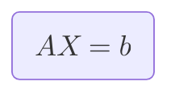

# 其他直接法

## 平方根法

平方根法是一种对称正定矩阵的三角分解法，广泛用于求解系数矩阵为对称正定的线性代数方程组。

假设线性方程组
$$
Ax=b
$$
其系数矩阵$A$为对称正定，则$A$的各阶顺序主子式和全部特征值均大于零。

> [!warning]
>
> 平方根法是对正定矩阵的LU分解。

**定理**

设矩阵$A$为对称正定矩阵，则存在唯一的非奇异下三角矩阵$L$，使得
$$
A=LL^T
$$
且$L$的对角元素皆为正数。

**推论**

设$A$为对称矩阵，$A$的所有顺序主子式不为零，则$A$可以唯一分解为
$$
A=LDL^T
$$
其中$L$为单位下三角矩阵，$D$为对角矩阵。

1. $A=LL^T$为平方根法。
2. $A=LDL^T$为改进的平方根法。不必选主元，算法稳定。

矩阵$A$有
$$
\begin{aligned} 
A 
&= LDL^T \\
&=
\begin{pmatrix}
1      & 0      & 0      & \cdots & 0 \\
l_{21} & 1      & 0      & \cdots & 0 \\
l_{31} & l_{32} & 1      & \cdots & 0 \\
\vdots & \vdots & \vdots & \ddots & \vdots \\
l_{n1} & l_{n2} & l_{n3} & \cdots & 1
\end{pmatrix}
\begin{pmatrix}
d_1 & 0   & 0   & \cdots & 0 \\
0   & d_2 & 0   & \cdots & 0 \\
0   & 0   & d_3 & \cdots & 0 \\
\vdots & \vdots & \vdots & \ddots & \vdots \\
0   & 0   & 0   & \cdots & d_n
\end{pmatrix}
\begin{pmatrix}
1      & l_{21} & l_{31} & \cdots & l_{n1} \\
0      & 1      & l_{32} & \cdots & l_{n2} \\
0      & 0      & 1      & \cdots & l_{n3} \\
\vdots & \vdots & \vdots & \ddots & \vdots \\
0      & 0      & 0      & \cdots & 1
\end{pmatrix}
\end{aligned}
$$
其中
$$
\left\{\begin{matrix}
d_{ii} = a_{ii} - \sum_{k=1}^{i-1} l_{ik}^2 d_{kk} \\
l_{ij} = \frac{1}{d_{jj}} \left( a_{ij} - \sum_{k=1}^{j-1} l_{ik} l_{jk} d_{kk} \right), \quad i > j
\end{matrix}\right.
$$

则原方程可以转换为
$$
\left\{\begin{matrix}
Ly=b \\
L^Tx=D^{-1}y
\end{matrix}\right.
$$
方程组$Ly=b $，计算过程
$$
\left\{\begin{matrix}
y_1 = b_1 & \\
y_i = b_i - \sum_{j=1}^{i-1} l_{ij} y_j & i = 2,3,\dots,n
\end{matrix}\right.
$$
求解$x$的过程
$$
\left\{\begin{matrix}
x_n = \frac{y_n}{d_n} & \\
x_i = \frac{y_i}{d_i} - \sum_{j=i+1}^{n} l_{ji} x_j & i = n-1,n-2,\dots,1
\end{matrix}\right.
$$
在平方法中，需要进行$n$次开方运算，为了避免这一点，一般采用$A=LDL^T$分解，即改进的平方根法。

> [!note]
>
> 用改进的平方根法解方程组

$$
\left\{\begin{array}{lll} 
x_1+2x_2+x_3=4 \\
2x_1+5x_2=7  \\
x_1+14x_3=15
\end{array}\right.
$$

系数矩阵$A$
$$
\begin{pmatrix}
1 & 2 & 1 \\
2 & 5 & 0 \\
1 & 0 & 14
\end{pmatrix}
$$
为正定矩阵，计算第一列元素
$$
d_1=1,\quad l_{21}=2, \quad l_{31}=1
$$
计算第二列元素
$$
d_{22}=5-2^2\times 1=1, \quad l_{32}=0-1\times 2=-2
$$


计算第三列元素
$$
d_{3}=14-1^2\times 1-(-2)^2\times 1=9
$$
回带得
$$
\begin{array}{lll} 
y_1=4 \\
y_2=7-2\times 4=-1 \\
y_3=15-1\times 4-(-2)\times (-1)=9  
\end{array}
$$
最后解得
$$
\begin{array}{lll} 
x_3=1 \\
x_2=-1-(-2)\times (-1)=9 \\
x_1=4-2\times 1-1\times 1=1 
\end{array}
$$

改进的平方根法计算复杂度为$O\left( \dfrac{1}{3}n^3 \right)$

## 追赶法

建立三次样条函数时，都会要解三对角方程组，追赶法就是用于解三对角方程组。

三对角方程组为
$$
\left\{
\begin{array}{lll}
b_1x_1 &+& c_1 x_2 & & & & &= d_1 \\
a_2x_1 &+&  b_2 x_2 &+ & c_2 x_3& & &= d_2 \\
&&&\cdots \\
& & a_{n-1}x_{n-2} &+& b_{n-1} x_{n-1} &+& c_{n-1} x_n &= d_{n-1} \\
& & &&a_nx_{n-1} &+& b_n x_n &= d_n
\end{array}
\right.
$$
对应系数矩阵为
$$
A =
\begin{pmatrix}
b_1 & c_1 & 0   & \cdots & 0      & 0 \\
a_2 & b_2 & c_2 & \cdots & 0      & 0 \\
0   & a_3 & b_3 & \cdots & 0      & 0 \\
\vdots & \vdots & \vdots & \ddots & \vdots & \vdots \\
0 & 0 & 0 & \cdots & b_{n-1} & c_{n-1} \\
0 & 0 & 0 & \cdots & a_n     & b_n \\
\end{pmatrix}
$$
设系数矩阵$A$满足下列条件

1. $a_i\ne0(i=2,3,\cdots,n)$，$c_i\ne0(i=1,2,\cdots,n-1)$。
2. $\left|b_1\right|>\left|c_1\right|$，$\left|b_i\right|>\left|a_i\right|+\left|c_i\right|(i=2,3,\cdots,n)$，$\left|b_n\right|>\left|a_n\right|$。（矩阵对角占优）

则它可以分解为
$$
\begin{aligned} 
 A &= LU \\ 
&=\begin{bmatrix}
1      & 0      & 0      & \cdots & 0 \\
l_2 & 1      & 0      & \cdots & 0 \\
0      & l_3 & 1      & \cdots & 0 \\
\vdots & \vdots & \vdots & \ddots & \vdots \\
0      & 0      & 0      & l_n & 1
\end{bmatrix}
\begin{bmatrix}
u_1    & c_1    & 0      & \cdots & 0 \\
0      & u_2    & c_2    & \cdots & 0 \\
0      & 0      & u_3    & \cdots & 0 \\
\vdots & \vdots & \vdots & \ddots & c_{n-1} \\
0      & 0      & 0      & 0      & u_n
\end{bmatrix}
\end{aligned}
$$
其中$C_i$，$i=1,2,\cdots,n-1$为$A$中给出，且分解是唯一的。分解的实质是高斯消元法，$LU$分解法的应用。事实上，将系数矩阵$A$做LU分解。分解一般项计算如下
$$
\left\{
\begin{array}{lll} 
u_1=b_1 \\
l_i=\frac{a_i}{u_{i-1}} & i=2,3,\cdots,n \\
u_i=b_i-c_{i-1}l_i 
\end{array}
\right.
$$
令$Ux=y$，则方程$Ax=b$可以转化为
$$
\left\{\begin{matrix}
Ux=y \\
Ly=b
\end{matrix}\right.
$$
三对角矩阵计算公式为
$$
\left\{\begin{matrix}
y_1=d_1 \\
y_k=d_k-l_ky_{k-1} & k=2,3,\cdots,n \\
x_n=\frac{y_n}{u_n}  \\
x_k=\frac{1}{u_k}\left(y_k-c_kx_{k+1}\right)  & k=n-1,n-2,\cdots,1
\end{matrix}\right.
$$
其中求$y_k$和$x_k$只与前一个或后一个元素有关，不需要再做求和。其中求$y_k$的过程为”追“，求$x_k$过程为”赶“，因此称为追赶法。

> [!note]
>
> 使用追赶法解方程组

$$
\left\{\begin{matrix}
-2x_1+x_2 & = 1 \\
x_1-2x_2  & = 1 \\
x_2-2x_3+x_4 & = 0 \\
 x_3 -2x_4 & =-1
\end{matrix}\right.
$$

方程组分解过程为
$$
\begin{aligned} 
\left[ A|b\right] &=
\begin{pmatrix}
-2 & 1 & 0 & 0 & 1\\
 1 & -2 & 0 & 0 & 1 \\
 0 & 1 & -2 & 1 & 0 \\
 0 & 0 & 1 & -2 & -1
\end{pmatrix}
\to 
\begin{pmatrix}
-2 & 1 & 0 & 0 & 1\\
-\frac{1}{2} & -2 & 0 & 0 & 1 \\
 0 & 1 & -2 & 1 & 0 \\
 0 & 0 & 1 & -2 & -1
\end{pmatrix} \\
&\to 
\begin{pmatrix}
-2 & 1 & 0 & 0 & 1\\
-\frac{1}{2} & -\frac{3}{2} & 0 & 0 & \frac{3}{2}  \\
 0 & -\frac{2}{3} & -2 & 1 & 0 \\
 0 & 0 & 1 & -2 & -1
\end{pmatrix} \to
\begin{pmatrix}
-2 & 1 & 0 & 0 & 1\\
-\frac{1}{2} & -\frac{3}{2} & 0 & 0 & \frac{3}{2}  \\
 0 & -\frac{2}{3} & -2 & 1 & 1 \\
 0 & 0 & -\frac{1}{2} & -\frac{3}{2} & -\frac{1}{2}
\end{pmatrix}
 \\
\end{aligned}
$$
同解三角方程组为$Ux=y$，即
$$
\begin{pmatrix}
-2 & 1 & 0 & 0\\
0 & -\frac{3}{2} & 0 & 0 \\
0 & 0 & -2 & 1 \\
0 & 0 & 0 & -\frac{3}{2} 
\end{pmatrix}
\begin{pmatrix}
x_1 \\
x_2 \\
x_3 \\
x_4
\end{pmatrix}
=\begin{pmatrix}
1 \\
\frac{3}{2} \\
1 \\
-\frac{1}{2}
\end{pmatrix}
$$
方程解得
$$
x_4=\frac{1}{3}, \quad x_3=\frac{1}{3}, \quad x_2 = -1, \quad x_1=-1
$$


追赶法解方程组计算复杂度为$O(n)$。追赶法实现程序如下

```python
import numpy as np

def solve_tridiagonal(a, b, c, d):
    n = len(b)

    # 检查维度一致性
    if not (len(a) == len(b) == len(c) == len(d)):
        raise ValueError("输入向量 a, b, c, d 长度必须相同")
    if b[0] == 0:
        raise ZeroDivisionError("主对角线首项不能为 0")

    cp = np.zeros(n)
    dp = np.zeros(n)
    x = np.zeros(n)

    cp[0] = c[0] / b[0]
    dp[0] = d[0] / b[0]

    for i in range(1, n):
        denom = b[i] - a[i] * cp[i - 1]
        if denom == 0:
            raise ZeroDivisionError(f"第 {i} 步出现除以 0 的情况，可能系统无解或矩阵奇异")
        cp[i] = c[i] / denom if i < n - 1 else 0
        dp[i] = (d[i] - a[i] * dp[i - 1]) / denom

    x[-1] = dp[-1]
    for i in range(n - 2, -1, -1):
        x[i] = dp[i] - cp[i] * x[i + 1]

    return x


a = [0, 1, 1, 1]
b = [-2, -2, -2, -2]
c = [1, 0, 1, 0]
d = [1, 1, 0, -1]

solution = solve_tridiagonal(a, b, c, d)
for i, val in enumerate(solution, 1):
    print(f"x_{i} = {val}")
```

## 线性方程组的解法





## 向量和矩阵的范数


